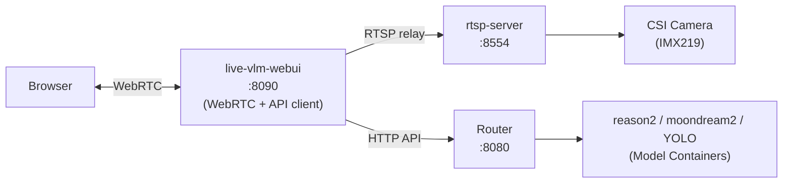

# Live VLM WebUI

This document covers the live-vlm-webui Docker container.
For Docker backend, model setup, and system configuration see [readme.md](readme.md).

## Overview

Official NVIDIA live-vlm-webui (`ghcr.io/nvidia-ai-iot/live-vlm-webui:latest-jetson-orin`),
customized with Jetson GPU monitor fix and pre-configured for the local Router API.
Provides a browser-based WebRTC frontend that relays CSI camera frames (via RTSP server)
and dispatches VLM inference through the Router at `localhost:8080`.

### 1. Architecture



The WebUI sits at the center: it relays the RTSP camera feed to the browser as WebRTC,
and forwards user prompts to the Router API for inference. Uses host networking
(`--network host`) for WebRTC (needs direct UDP) and RTSP relay (`localhost:8554`).
Model inference goes through the Router on the `vlm-net` bridged network.

### 2. Pipeline

```
CSI Camera → rtsp-server (H.264 RTSP) → live-vlm-webui (WebRTC relay) → Browser
                                   live-vlm-webui → Router API → Model → Response → overlay
```

The WebUI streams the RTSP feed to the browser as WebRTC.  When the user submits a
prompt, the WebUI captures the current frame, sends it to the Router API, and displays
the inference result as an overlay.

### 3. Dockerfile Customizations

The Dockerfile applies two changes on top of the official image:

- GPU Monitor Patch

`patch_gpu_monitor.py` fixes GPU utilization reporting for Jetson:
- Adds `/sys/devices/platform/*/gpu.0/load` fallback when jtop returns 0
- Skips nvidia-smi fallback on Jetson (VRAM=0 is normal with unified memory)

- API Defaults

Pre-configured environment variables point to the local Router:

| Variable | Value |
|----------|-------|
| `LIVE_VLM_API_BASE` | `http://localhost:8080/v1` |
| `LIVE_VLM_DEFAULT_MODEL` | `reason2` |

## Install & Launch

### 1. Install

Run the setup scripts in order (`01-disable-gui.sh` through `05-build-all.sh`) —
this configures Xorg + openbox (enables full-speed Argus), CSI camera, MAXN power mode,
memory tuning, downloads models, and builds all Docker images. The `live-vlm-webui` image
is built as part of `05-build-all.sh`.

### 2. Launch

```bash
bash scripts/14-start-live-vlm-webui.sh [OPTIONS]
```

| Option | Default | Description |
|--------|---------|-------------|
| `--port N` | 8554 | WebUI listening port (default: 8090) |
| `--help, -h` | — | Show usage |

The start script checks that no existing instance is running, removes any stale
container, then launches with the specified port (default 8090).

> 📄 Start: `scripts/14-start-live-vlm-webui.sh`
> 📄 Stop: `scripts/15-stop-live-vlm-webui.sh`

## 3. Access

```
http://<jetson-ip>:8090
```

Local access from Jetson desktop:

```
http://localhost:8090
```

The browser connects via WebRTC (ICE/DTLS/SCTP/SRTP).  Ensure the Jetson and the
client browser are on the same network (no NAT traversal).

## Troubleshooting

### 1. GPU monitor always shows 0%

Normal on Jetson with unified memory. The `patch_gpu_monitor.py` fix is already
applied in the Dockerfile — GPU load is read from sysfs.  If still 0%, the container
may have been built without the patch.

### 2. WebRTC connection fails (ICE disconnected)

WebUI uses `--network host` for direct UDP.  If the browser is behind NAT or a
different subnet, WebRTC may fail.  Ensure browser and Jetson are on the same LAN.
