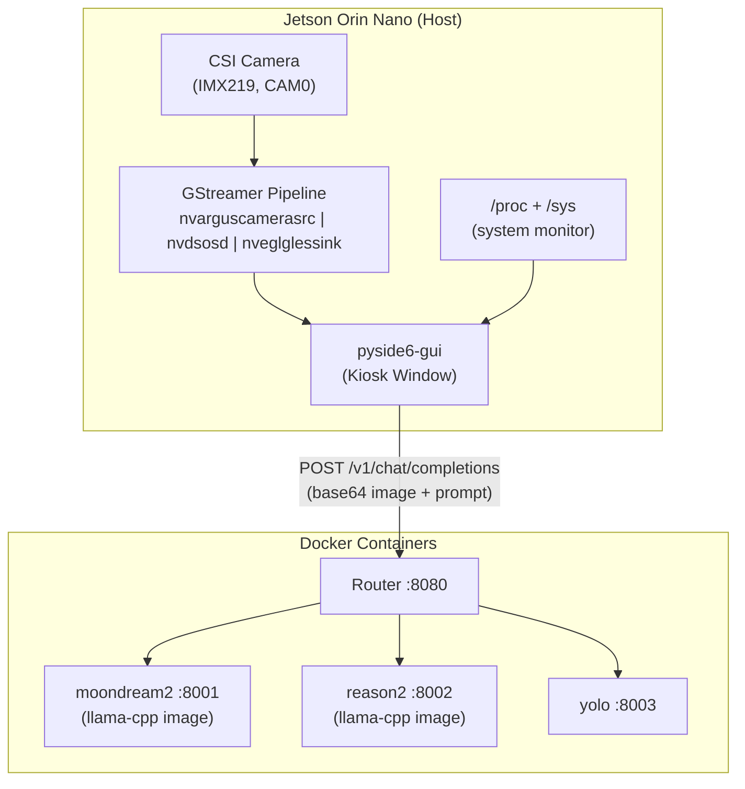
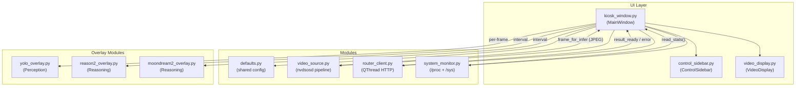
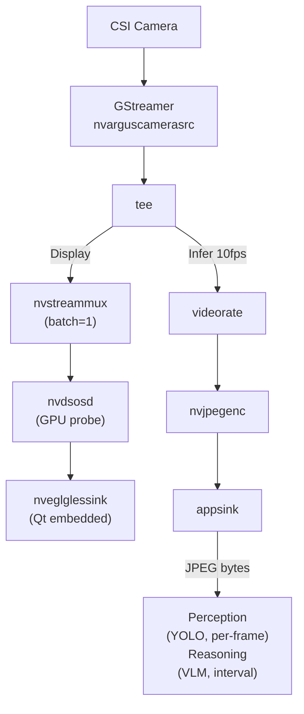

# Kiosk VLM GUI

A PySide6 kiosk GUI.
For Docker backend, model setup, and system configuration see [readme.md](readme.md).
For the browser-based WebUI alternative, see [live-vlm-webui.md](live-vlm-webui.md).

## Overview

Single-window kiosk GUI for live CSI camera streaming with router-based multi-model VLM inference.
All AI inference is delegated to Docker containers via the Router API.

### 1. Architecture

**System-level:**



**Module-level:**



**Frame flow (nvdsosd dual pipeline):**



### 2. Function Blocks

| Aspect | pyside6-gui |
|--------|-------------|
| **Video capture** | GStreamer `nvdsosd` → `nveglglessink` (GPU render, no QImage) |
| **AI inference** | Router API (docker containers), async HTTP |
| **UI layout** | Single kiosk window, left sidebar + right video |
| **Overlay drawing** | nvdsosd GPU probe (no QPainter) |
| **System monitor** | /proc + /sys (GPU/CPU/RAM/VRAM) top-right OSD |
| **Camera source** | CSI only: `nvarguscamerasrc` with NVMM zero-copy |

## Install & Launch

### 1. Install

Run the setup scripts in order (`01-disable-gui.sh` through `05-build-all.sh`) —
this configures Xorg + openbox (enables full-speed Argus), CSI camera, MAXN power mode,
memory tuning, downloads models, and builds all Docker images. The Python venv is
created by `09-install-pyside6-gui.sh`.

> 📄 Script: `scripts/09-install-pyside6-gui.sh`

### 2. Launch

```bash
bash scripts/10-start-pyside6-gui.sh [OPTIONS]
```

Key CLI options:
- `--play` — Auto-start streaming
- `--perception-model yolo|disable` — Perception AI model
- `--reasoning-model reason2|moondream2|disable` — Reasoning AI model
- `--router-url URL` — Router API URL
- `--ram-threshold GiB` — RAM threshold for container restart
- `--dpi-scale`, `--camera-id`, `--resolution`, `--interval`, `--prompt`, `--max-tokens`

Handles Xorg/openbox lifecycle, `nvargus-daemon`, and `DISPLAY=:0` automatically.
Kiosk fullscreen mode with `Qt.FramelessWindowHint`.

> 📄 Script: `scripts/10-start-pyside6-gui.sh`

## UI Design

### 1. Video Source

| Control | Type | Description |
|---------|------|-------------|
| Camera ID | QComboBox | Scans `/dev/video*` at startup; re-scans on dropdown open |
| Resolution/FPS | QComboBox | Populated via `v4l2-ctl --list-formats-ext` on startup or Camera ID change |

**Pipeline:** `nvarguscamerasrc` with NVMM zero-copy. FPS is auto-detected from hardware capabilities via `v4l2-ctl`.

### 2. Perception AI

| Control | Type | Default | Description |
|---------|------|---------|-------------|
| Model | QComboBox | yolo/disable | Object detection. Fire-and-forget per-frame. |

### 3. Reasoning AI

| Control | Type | Default | Description |
|---------|------|---------|-------------|
| Model | QComboBox | reason2/disable | VLM caption. Interval-based inference. |
| Interval | QLineEdit (≥1) | 1000 | Milliseconds between reasoning requests |
| Prompt | QTextEdit | `"Describe this image..."` | Prompt sent to VLM |
| Max Tokens | QLineEdit (1–2048) | 512 | Response token limit |

### 4. Control

```
┌─ Left Sidebar (1/6) ────────┬─ Video Display (5/6) ────────────────────┐
│                             │                                          │
│  Camera                     │    ┌──────────────────────────────────┐  │
│  Camera ID:  [0 ▼]          │    │   FPS:29.0 | GPU:45% CPU:62%     │  │
│  Res/FPS:    [1920x1080@30] │    │   RAM:3.8G                       │  │
│  ─────────────────────────  │    │                                  │  │
│  Perception AI              │    │                                  │  │
│  Model:      [yolo ▼]       │    │                                  │  │
│  ─────────────────────────  │    │ ┌──────────────┐                 │  │
│  Reasoning AI               │    │ │ person 0.87  │                 │  │
│  Model:      [reason2 ▼]    │    │ │              │                 │  │
│  Interval:   [1000] ms      │    │ │              │                 │  │
│  Prompt:                    │    │ │              │                 │  │
│  ┌──────────────────────┐   │    │ └──────────────┘                 │  │
│  │Describe this image...│   │    │                                  │  │
│  └──────────────────────┘   │    │ ┌──────────────────────────────┐ │  │
│  Max Tokens: [512]          │    │ │ Elapsed: 5772ms              │ │  │
│       [▶ START]  [✕ QUIT]  │    │ │ A blue bus parked on a...    │ │  │
│                             │    │ └──────────────────────────────┘ │  │
└─────────────────────────────┴────┴──────────────────────────────────┴──┘
```

- Select camera and resolution.
- Choose a Perception AI model (YOLO, per-frame fire-and-forget).
- Choose a Reasoning AI model (reason2/moondream2, interval-based).
- Set interval, prompt, and max tokens.
- Press **START** to begin streaming and inference.
- Press **STOP** to halt all inference.
- Press **QUIT** to exit.

### 5. Keyboard Navigation

All controls support standard Qt keyboard navigation:

- **Tab** / **Shift+Tab**: move focus between controls in logical order (Camera ID → Resolution → Perception Model → Reasoning Model → Interval → Prompt → Max Tokens → START → QUIT)
- **Space**: activate focused buttons
- **Arrow keys**: navigate QComboBox dropdown items

## OSD Overlay and Performance

### 1. Video Rendering Strategy

The GStreamer pipeline uses a dual-branch tee:

```
nvarguscamerasrc ! NV12 (NVMM) ! tee t

  [Display] t. ! nvstreammux (batch=1) ! nvdsosd (GPU probe) !
               nvegltransform ! nveglglessink (sync=false)

  [Infer]   t. ! nvvidconv ! I420 ! videorate (10fps) ! nvjpegenc !
               appsink (JPEG bytes)
```

**Display branch:** `nveglglessink` renders directly to a Qt `QLabel` widget via
`prepare-window-handle` sync bus handler. Zero CPU overhead — all rendering is GPU.

**Infer branch:** Scaled to ≤1280px, rate-limited to 10fps, hardware JPEG encoded.
JPEG bytes are emitted via `frame_for_infer` signal to the main thread for AI requests.

**OSD / overlay:** All text and bounding boxes are drawn by `nvdsosd` GPU probe
(`pyds` metadata injection) — top-right FPS/GPU/CPU/RAM OSD, YOLO bboxes with labels,
and reasoning caption bar at the bottom. No QPainter or CPU drawing.

| Approach | CPU cost | GPU cost |
|----------|----------|----------|
| **nvdsosd + nveglglessink (chosen)** | ~0ms | GPU render |
| QPainter overlay (old) | ~1-5ms per frame | negligible |
| nvoverlaysink (HW) | 0ms | cannot embed in Qt |

**Resolution/Framerate:**

| Resolution | Display FPS | Infer FPS |
|-----------|-------------|-----------|
| 1920×1080 | 30 | 10 |
| 3280×2464 | 21 | 10 |
| 1280×720 | 60 | 10 |

**Critical:** `DISPLAY=:0` and Xorg are required for full-speed Argus capture.
The `10-start-pyside6-gui.sh` script handles this automatically.

### 2. Overlay Behavior

Inference results are drawn on the video via overlay modules (`yolo_overlay.py`, `reason2_overlay.py`,
`moondream2_overlay.py`). All three modules expose the same interface:

```python
prepare_payload(b64: str, prompt: str, max_tokens: int) -> str
```

The main program dispatches via PREPARE dict without model-specific branching. Drawing is handled by nvdsosd GPU probe.

| Model | Visual Overlay | Caption Bar |
|-------|---------------|-------------|
| **YOLO** | Per-class colored bounding boxes with label and confidence (e.g., `person 0.87`). Bboxes persist until next inference. Coords scaled from infer→display resolution. | No caption |
| **moondream2** | — | Caption bar: black rect background + "Elapsed: xxxms" header + response text |
| **reason2** | — | Caption bar: black rect background + "Elapsed: xxxms" header + response text |

YOLO bounding boxes are drawn on **every frame** by the nvdsosd probe using the last
successful detection JSON. Boxes persist until the next inference updates them.
Switching to disable clears persisted boxes.

### 3. Slot-Based Dispatch

Perception and reasoning pipelines each use an independent `_Slot` state machine:

```python
class _Slot:
    name: str           # "yolo" / "reason2" / "moondream2" / "disable"
    prepare: callable   # prepare_payload(b64, prompt, max_tokens) -> str
    fill: callable      # fill_display_meta(display_meta, result, w, h, s, ds, label_idx) -> int
    pending: bool       # True = previous HTTP request still in-flight
    result: dict        # {"response": str, "elapsed_ms": float}
    infer_start: float  # time.time() when request was sent
```

**Dispatch rules:**

- **Per-frame (YOLO):** `_maybe_fire(_perc, jpeg)` — skip if `pending` or model is `disable`
- **Interval (reasoning):** `_on_interval_tick` -> `_maybe_fire(_reos, jpeg)` — same guard
- **Result handler:** sets `slot.pending = False`, stores `{"response": text, "elapsed_ms": ms}` in `slot.result`
- **nvdsosd probe:** `_osd_probe` calls `slot.fill(display_meta, slot.result, ...)` for each active slot — no model-specific logic in the probe itself

**Model change:** `_on_perception_changed` / `_on_reasoning_changed` -> `slot.activate(model_name)` — looks up `prepare_payload` + `fill_display_meta` from `yolo_overlay` / `reason2_overlay` / `moondream2_overlay`.

**One-at-a-time:** `slot.pending` prevents overlapping HTTP requests within the same slot. On error or timeout, `slot.pending` is cleared via `_on_router_error`. On STOP, both slots' `pending` and `result` are cleared.

**Overlay modules** (`*_overlay.py`) expose two functions:
```python
prepare_payload(b64: str, prompt: str, max_tokens: int) -> str
fill_display_meta(display_meta, result: dict, w, h, s, ds, label_idx) -> int
```
No model-specific code in `kiosk_window.py`. Adding a new model only requires a new overlay file + entry in `MODULES` dict.

### 4. System Monitor OSD & Console Log

The GUI outputs performance stats every 5 seconds both as OSD overlay and console log:

```
17:58:17 [gui] Streaming 1920x1080@30 perception=yolo reasoning=reason2 interval=1000ms
17:58:19 [gui] POST -> reason2 (554 KB)
17:58:27 [gui] <- reason2 OK (7624ms)
17:58:27 [gui]   A blue bus parked on a city street...
17:58:27 [gui] FPS:16.3 | GPU:0% CPU:71% RAM:4.2G
17:58:32 [gui] FPS:17.7 | GPU:1% CPU:52% RAM:4.3G
 Ctrl+C
17:58:40 [gui] Shutting down.
```

| Field | Source | Description |
|---|---|---|
| `FPS` | frame counter / elapsed | Input FPS from camera |
| `GPU` | `/sys/devices/platform/gpu.0/load` | GPU utilization % |
| `CPU` | `/proc/stat` delta | CPU utilization % |
| `RAM` | `/proc/meminfo` | System RAM used (GiB) |

No jetson-stats dependency — pure `/proc` + `/sys` only.

Reasoning result text is printed to console. YOLO result text is logged only as timing (`<- yolo OK (135ms)`).

All counters reset to zero on each **Start** to provide clean per-session values.

## Router Integration

### 1. Model Discovery (startup)

```http
GET http://localhost:8080/v1/models
```

Response:

```json
{
  "object": "list",
  "data": [
    {"id": "reason2", "object": "model", "owned_by": "jetson"},
    {"id": "moondream2", "object": "model", "owned_by": "jetson"},
    {"id": "yolo", "object": "model", "owned_by": "jetson"}
  ]
}
```

Only available models appear in the dropdown. If a container is stopped, its model is excluded.

### 2. Inference Request (per interval)

```http
POST http://localhost:8080/v1/chat/completions
Content-Type: application/json

{
  "model": "reason2",
  "messages": [{
    "role": "user",
    "content": [
      {"type": "image_url", "image_url": {"url": "data:image/jpeg;base64,/9j/4AAQ..."}},
      {"type": "text", "text": "Describe this image in one sentence."}
    ]
  }],
  "max_tokens": 512
}
```

### 3. Response Handling

| Model | Response Content | Overlay Action |
|-------|-----------------|----------------|
| `reason2` | `{"choices":[{"message":{"content":"A blue bus parked on a city street."}}]}` | nvdsosd caption bar |
| `moondream2` | `{"choices":[{"message":{"content":"A blue bus parked on a city street."}}]}` | nvdsosd caption bar |
| `yolo` | `{"choices":[{"message":{"content":"[{\"class\":2,\"name\":\"car\",\"confidence\":0.87,\"bbox\":[...]}]"}}]}` | nvdsosd colored bounding boxes |

YOLO response is parsed as JSON; class name and confidence are drawn on each box.

### 4. Design

```mermaid
sequenceDiagram
    participant GST as GStreamer Pipeline
    participant UI as MainWindow
    participant SlotP as _Slot (perception)
    participant SlotR as _Slot (reasoning)
    participant Mod as Overlay Module
    participant RTR as Router :8080
    participant Backend as Model Container

    GST->>UI: frame_for_infer (JPEG, 10fps)
    note right of UI: nvdsosd draws per-frame (GPU)<br/>via slot.fill(display_meta)

    rect rgb(40, 60, 40)
        note right of UI: Perception (fire-and-forget)
        UI->>SlotP: _maybe_fire (skip if pending)
        SlotP->>Mod: prepare_payload(b64)
        Mod-->>SlotP: JSON payload
        SlotP->>RTR: POST /v1/chat/completions
        RTR->>Backend: forward
    end

    loop Every N ms (Interval)
        rect rgb(60, 40, 40)
            note right of UI: Reasoning (interval)
            UI->>SlotR: _maybe_fire (skip if pending)
            SlotR->>Mod: prepare_payload(b64)
            Mod-->>SlotR: JSON payload
            SlotR->>RTR: POST /v1/chat/completions
            RTR->>Backend: forward
        end
    end

    Backend-->>RTR: inference result
    RTR-->>UI: result_ready(model, response)
    UI->>SlotR: slot.result = {response, elapsed_ms}
    SlotR->>SlotR: slot.pending = False

    alt Model change
        UI->>SlotR: slot.activate("yolo" / "reason2")
        note right of SlotR: lookup prepare + fill<br/>from overlay module
    end
```



- YOLO requests fire per-frame (non-blocking, fire-and-forget). Bboxes update independently from reasoning.
- Reasoning requests fire at intervals. Requests are skipped if a previous one is still pending.
- Both pipelines share the same RouterClient with concurrent request support.

## Troubleshooting

### 1. Argus FPS too low (~3 fps)

Argus (nvarguscamerasrc) requires an X server for full-speed capture. Ensure Xorg is running and `DISPLAY=:0` is set. The `10-start-pyside6-gui.sh` start script handles this automatically.

Use the command to verify:

```bash
gst-launch-1.0 -v \
      nvarguscamerasrc ! \
      'video/x-raw(memory:NVMM),width=1280,height=720,format=NV12' ! \
      nvvidconv ! \
      fpsdisplaysink sync=false text-overlay=false video-sink=fakesink
```

### 2. CMA / NVMM allocation failure

**Symptoms:** `NvMapMemAllocInternalTagged: error 12`, `Failed to create CaptureSession`,
or camera fails to start after STOP/START cycle, especially at high resolutions.

**Root cause:** Docker model containers and nvarguscamerasrc share the CMA region.
After extended streaming, CMA becomes fragmented — even if total free memory is sufficient,
continuous blocks large enough for NVMM buffers are unavailable.

**Fix (cold restart — most reliable):**

```bash
sudo reboot
```

**Alternative (without reboot):**

```bash
sudo docker stop $(sudo docker ps -q) 2>/dev/null
sudo systemctl stop nvargus-daemon
sudo sync && echo 3 | sudo tee /proc/sys/vm/drop_caches
echo 1 | sudo tee /proc/sys/vm/compact_memory
sudo systemctl start nvargus-daemon
# Then restart model containers and GUI
```

### 3. No video — black screen

```bash
# Restart nvargus-daemon (CSI cameras only)
sudo systemctl restart nvargus-daemon

# Verify camera is detected
ls /dev/video*
v4l2-ctl -d /dev/video0 --list-formats-ext

# Test raw GStreamer pipeline
gst-launch-1.0 -v \
      nvarguscamerasrc ! \
      'video/x-raw(memory:NVMM),width=1280,height=720,format=NV12' ! \
      nvvidconv ! \
      fpsdisplaysink sync=false text-overlay=false video-sink=fakesink
```

### 4. Module 'gi' not found

```bash
# Ensure GObject Introspection is installed at system level
sudo apt install -y gir1.2-gstreamer-1.0 gir1.2-gst-plugins-base-1.0

# Venv must be created with --system-site-packages
rm -rf pyside6-gui-venv
python3 -m venv --system-site-packages pyside6-gui-venv
source pyside6-gui-venv/bin/activate
pip install pyside6 aiohttp
```

### 5. Model dropdown empty

```bash
# Check router is running
curl -s http://localhost:8080/health

# Check which models are available
curl -s http://localhost:8080/v1/models | python3 -m json.tool

# Start a model container if needed
bash scripts/06-start-models.sh
```

### 6. Inference returns error

- YOLO response is not valid JSON → check router logs: `sudo docker logs router`
- Timeout → model container may be OOM: `sudo docker logs reason2`
- Models share the same `llama-cpp` image — multiple containers can run concurrently, but monitor RAM via the built-in RAM monitor

### 7. PySide6 crashes on startup: "Could not load Qt platform plugin"

```bash
sudo apt install -y libxcb-cursor0
export QT_QPA_PLATFORM=xcb
```

