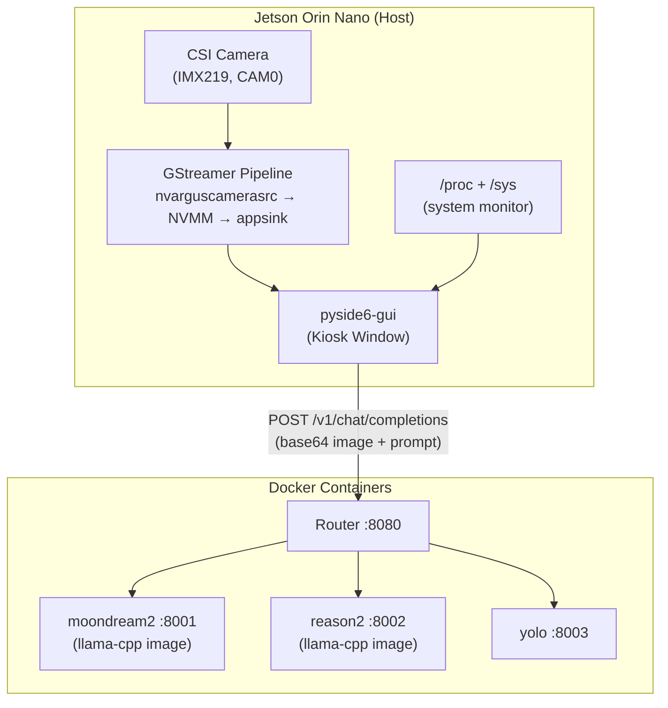
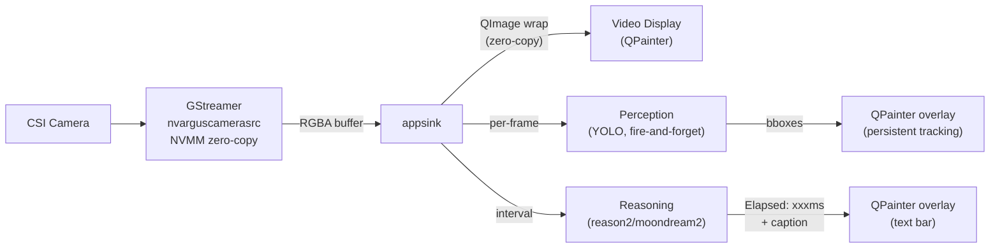
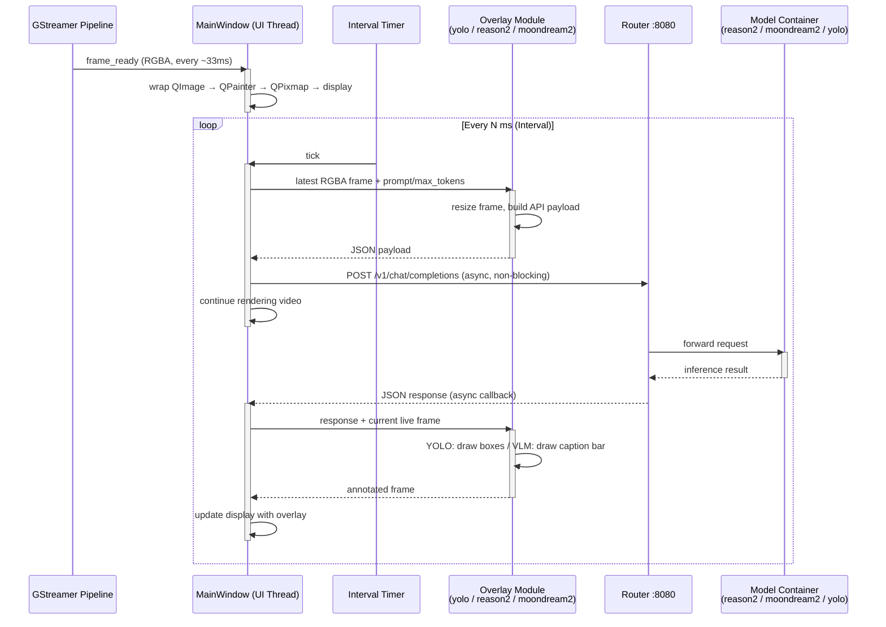

# Kiosk VLM GUI

A PySide6 kiosk GUI.
For Docker backend, model setup, and system configuration see [readme.md](readme.md).
For the browser-based WebUI alternative, see [live-vlm-webui.md](live-vlm-webui.md).

## Overview

Single-window kiosk GUI for live CSI camera streaming with router-based multi-model VLM inference.
All AI inference is delegated to Docker containers via the Router API.

### 1. Architecture

**System-level:**



**Module-level:**


**Frame flow:**



### 2. Function Blocks

| Aspect | pyside6-gui |
|--------|-------------|
| **Video capture** | GStreamer `appsink` → RGBA buffer → `QImage` (zero-copy, no cv2) |
| **AI inference** | Router API (docker containers), async HTTP |
| **UI layout** | Single kiosk window, left sidebar + right video |
| **Overlay drawing** | QPainter on QWidget (no cv2) |
| **System monitor** | /proc + /sys (GPU/CPU/RAM/VRAM) top-right OSD |
| **Camera source** | CSI only: `nvarguscamerasrc` with NVMM zero-copy |

## Install & Launch

### 1. Install

Run the setup scripts in order (`01-disable-gui.sh` through `05-build-all.sh`) —
this configures Xorg + openbox (enables full-speed Argus), CSI camera, MAXN power mode,
memory tuning, downloads models, and builds all Docker images. The Python venv is
created by `09-install-pyside6-gui.sh`.

> 📄 Script: `scripts/09-install-pyside6-gui.sh`

### 2. Launch

```bash
bash scripts/10-start-pyside6-gui.sh [OPTIONS]
```

Key CLI options:
- `--play` — Auto-start streaming
- `--perception-model yolo|disable` — Perception AI model
- `--reasoning-model reason2|moondream2|disable` — Reasoning AI model
- `--router-url URL` — Router API URL
- `--ram-threshold GiB` — RAM threshold for container restart
- `--dpi-scale`, `--camera-id`, `--resolution`, `--interval`, `--prompt`, `--max-tokens`

Handles Xorg/openbox lifecycle, `nvargus-daemon`, and `DISPLAY=:0` automatically.
Kiosk fullscreen mode with `Qt.FramelessWindowHint`.

> 📄 Script: `scripts/10-start-pyside6-gui.sh`

## UI Design

### 1. Video Source

| Control | Type | Description |
|---------|------|-------------|
| Camera ID | QComboBox | Scans `/dev/video*` at startup; re-scans on dropdown open |
| Resolution/FPS | QComboBox | Populated via `v4l2-ctl --list-formats-ext` on startup or Camera ID change |

**Pipeline:** `nvarguscamerasrc` with NVMM zero-copy. FPS is auto-detected from hardware capabilities via `v4l2-ctl`.

### 2. Perception AI

| Control | Type | Default | Description |
|---------|------|---------|-------------|
| Model | QComboBox | yolo/disable | Object detection. Fire-and-forget per-frame. |

### 3. Reasoning AI

| Control | Type | Default | Description |
|---------|------|---------|-------------|
| Model | QComboBox | reason2/disable | VLM caption. Interval-based inference. |
| Interval | QLineEdit (≥1) | 1000 | Milliseconds between reasoning requests |
| Prompt | QTextEdit | `"Describe this image..."` | Prompt sent to VLM |
| Max Tokens | QLineEdit (1–2048) | 512 | Response token limit |

### 4. Control

```
┌─ Left Sidebar (1/6) ────────┬─ Video Display (5/6) ────────────────────┐
│                             │                                          │
│  Camera                     │    ┌──────────────────────────────────┐  │
│  Camera ID:  [0 ▼]          │    │   FPS:29.0 | GPU:45% CPU:62%     │  │
│  Res/FPS:    [1920x1080@30] │    │   RAM:3.8G                       │  │
│  ─────────────────────────  │    │                                  │  │
│  Perception AI              │    │                                  │  │
│  Model:      [yolo ▼]       │    │                                  │  │
│  ─────────────────────────  │    │ ┌──────────────┐                 │  │
│  Reasoning AI               │    │ │ person 0.87  │                 │  │
│  Model:      [reason2 ▼]    │    │ │              │                 │  │
│  Interval:   [1000] ms      │    │ │              │                 │  │
│  Prompt:                    │    │ │              │                 │  │
│  ┌──────────────────────┐   │    │ └──────────────┘                 │  │
│  │Describe this image...│   │    │                                  │  │
│  └──────────────────────┘   │    │ ┌──────────────────────────────┐ │  │
│  Max Tokens: [512]          │    │ │ Elapsed: 5772ms              │ │  │
│       [▶ START]  [✕ QUIT]  │    │ │ A blue bus parked on a...    │ │  │
│                             │    │ └──────────────────────────────┘ │  │
└─────────────────────────────┴────┴──────────────────────────────────┴──┘
```

- Select camera and resolution.
- Choose a Perception AI model (YOLO, per-frame fire-and-forget).
- Choose a Reasoning AI model (reason2/moondream2, interval-based).
- Set interval, prompt, and max tokens.
- Press **START** to begin streaming and inference.
- Press **STOP** to halt all inference.
- Press **QUIT** to exit.

### 5. Keyboard Navigation

All controls support standard Qt keyboard navigation:

- **Tab** / **Shift+Tab**: move focus between controls in logical order (Camera ID → Resolution → Perception Model → Reasoning Model → Interval → Prompt → Max Tokens → START → QUIT)
- **Space**: activate focused buttons
- **Arrow keys**: navigate QComboBox dropdown items

## OSD Overlay and Performance

### 1. Video Rendering Strategy

The GStreamer pipeline outputs RGBA (not BGR):

```
nvarguscamerasrc ! video/x-raw(memory:NVMM),format=NV12 !
  nvvidconv ! video/x-raw,format=RGBA !
  appsink
```

This is intentional: the RGBA buffer maps directly to `QImage::Format_RGBA8888` with **zero pixel conversion** — `QImage` wraps the raw GStreamer buffer bytes via `QImage(uchar_ptr, w, h, Format_RGBA8888)` without copying or swizzling.

| Approach | Cost per 1080p frame | Why not used |
|----------|---------------------|--------------|
| **RGBA → QImage (chosen)** | ~0.3ms wrap | — |
| BGR → RGB → QImage (cv2-style) | ~3ms conversion | unnecessary extra pass |
| QOpenGLWidget + texture | ~0.2ms upload | GL context management overhead; marginal gain |
| nvoverlaysink (HW overlay) | 0ms | cannot draw QPainter UI elements on top |

QPainter overlays (bounding boxes, caption bar, monitor text) add ~1–2ms per frame. Total rendering pipeline stays under 5ms at 1920×1080 — well within a 33ms budget at 30fps.

**Resolution / Framerate Headroom:**

Measured on Jetson Orin Nano with IMX219 (DISPLAY=:0 required for full speed):

| Resolution | Target FPS | Measured FPS | Render Cost | Status |
|-----------|-----|-------------|-------------|--------|
| 1280×720 | 60 | ~58 (steady) | ~2ms | ✓ verified 15min stable |
| 1920×1080 | 30 | ~29 (steady) | ~5ms | ✓ verified 15min stable |
| 3280×2464 | 21 | ~18 (steady) | ~8ms | ✓ verified with reason2 (~5s/inf) & yolo (~150ms/inf) |

**Critical:** Without `DISPLAY=:0` and a running Xorg server, Argus falls back to a slow
capture path (~3 fps regardless of mode). The `10-start-pyside6-gui.sh` start script handles
this automatically.

**4K notes:**

- The main cost jump is QPainter text rendering at higher pixel density (~3ms → ~5ms) plus the larger RGBA buffer package (~33MB).
- QImage **must** use the Qt6 zero-copy constructor (`uchar*` + explicit cleanup null) to avoid a 33MB per-frame memcpy — a deep copy at 4K adds ~4ms and pushes total to ~14ms (58% CPU), still viable but tight.
- IMX219 max sensor resolution is 3280×2464 (not true 3840×2160); native 4K requires a different CSI sensor. Pipeline caps are uncapped to accommodate future sensors.
- JPEG encoding for router API uploads uses GStreamer's `jpegenc` (hardware-accelerated on Jetson) via `nvjpegenc`, not Python/PIL — avoids O(width×height) CPU-bound encode at all resolutions.

**1920×1080@60 note:** IMX219 maxes at 1080p@30. Confirm sensor capability before expecting 60fps at 1080p. 720p@60 is supported by IMX219 and validated.

### 2. Overlay Behavior

Inference results are drawn on the video via overlay modules (`yolo_overlay.py`, `reason2_overlay.py`,
`moondream2_overlay.py`). All three modules expose the same interface:

```python
prepare_payload(frame: QImage, prompt: str, max_tokens: int) -> str
draw_overlay(qimage: QImage, response_text: str) -> QImage
```

The main program dispatches via dict without model-specific branching.

| Model | Visual Overlay | Caption Bar |
|-------|---------------|-------------|
| **YOLO** | Colored bounding boxes with class label and confidence (e.g., `person 0.87`). Boxes persist across frames for tracking effect. Bbox coordinates are scaled from inference resolution (≤1280px) back to display resolution. | No caption (response is JSON, not human-readable text) |
| **moondream2** | Response text drawn as semi-transparent black bar at image bottom | Yes |
| **reason2** | Response text drawn as semi-transparent black bar at image bottom | Yes |

YOLO bounding boxes are drawn on **every frame** (not just on inference result), using the last
successful detection JSON. This provides a tracking-like effect — boxes stay visible until the
next inference updates them. Switching away from YOLO clears persisted boxes.

YOLO handles "No objects detected." responses gracefully (no overlay drawn, no warning logged).

### 3. System Monitor OSD & Console Log

The GUI outputs performance stats every 5 seconds both as OSD overlay and console log:

```
17:58:17 [gui] Streaming 3280x2464@21 — interval 1000ms, model reason2
17:58:19 [gui] POST /v1/chat/completions → reason2 (554 KB)
17:58:27 [gui] in:16.3 | reason:7624ms | GPU:0% CPU:71% RAM:4.2G VRAM:4.2G
17:58:32 [gui] in:17.7 | reason:7624ms | GPU:1% CPU:52% RAM:4.3G VRAM:4.3G
17:58:37 [gui] in:17.5 | reason:7624ms | GPU:0% CPU:77% RAM:4.3G VRAM:4.3G
^C
17:58:40 [gui] Shutting down.
```

| Field | Source | Description |
|---|---|---|
| `in` | frame counter / elapsed | Average input FPS from camera |
| `reason` | cumulative / count | Average inference wall-clock time (POST → full response) |
| `overlay` | cumulative / count | Average overlay drawing time (GUI: measured via synchronous `repaint()`) |
| `GPU` | `/sys/devices/platform/gpu.0/load` | GPU utilization % (instantaneous sample) |
| `CPU` | `/proc/stat` delta | CPU utilization % |
| `RAM` | `/proc/meminfo` | System RAM used (GiB) |
| `VRAM` | = RAM | Unified memory on Jetson Orin Nano |

No jetson-stats dependency — pure `/proc` + `/sys` only.

Inference result text is **not** printed to the console/log (only the stats line). POST events
are logged separately on their own line.

All counters (`_input_count`, `_reason_ms`, `_overlay_ms`, `_infer_count`) reset to zero on each
**Start** to provide clean per-session averages.

## Router Integration

### 1. Model Discovery (startup)

```http
GET http://localhost:8080/v1/models
```

Response:

```json
{
  "object": "list",
  "data": [
    {"id": "reason2", "object": "model", "owned_by": "jetson"},
    {"id": "moondream2", "object": "model", "owned_by": "jetson"},
    {"id": "yolo", "object": "model", "owned_by": "jetson"}
  ]
}
```

Only available models appear in the dropdown. If a container is stopped, its model is excluded.

### 2. Inference Request (per interval)

```http
POST http://localhost:8080/v1/chat/completions
Content-Type: application/json

{
  "model": "reason2",
  "messages": [{
    "role": "user",
    "content": [
      {"type": "text", "text": "Describe this image in one sentence."},
      {"type": "image_url", "image_url": {"url": "data:image/jpeg;base64,/9j/4AAQ..."}}
    ]
  }],
  "max_tokens": 512
}
```

### 3. Response Handling

| Model | Response Content | Overlay Action |
|-------|-----------------|----------------|
| `reason2` | `{"choices":[{"message":{"content":"A blue bus parked on a city street."}}]}` | Draw caption bar |
| `moondream2` | `{"choices":[{"message":{"content":"A blue bus parked on a city street."}}]}` | Draw caption bar |
| `yolo` | `{"choices":[{"message":{"content":"[{\"class\":2,\"name\":\"car\",\"confidence\":0.87,\"bbox\":[...]}]"}}]}` | Draw colored bounding boxes |

YOLO response is parsed as JSON; class name and confidence are drawn on each box.

### 4. Design



- The GStreamer pipeline emits frames continuously; the UI never blocks waiting for inference.
- At each interval tick, the latest frame is captured and sent to the Router asynchronously via `aiohttp` in a background `QThread`.
- When the response arrives, the overlay module draws on the **current live frame** (not the original captured frame) — the display always shows up-to-date video.
- If a new interval tick fires before the previous response arrives, the tick is skipped (`_pending` guard) — no queue build-up.

## Troubleshooting

### 1. Argus FPS too low (~3 fps)

Argus (nvarguscamerasrc) requires an X server for full-speed capture. Ensure Xorg is running and `DISPLAY=:0` is set. The `10-start-pyside6-gui.sh` start script handles this automatically.

Use the command to verify:

```bash
gst-launch-1.0 -v \
      nvarguscamerasrc ! \
      'video/x-raw(memory:NVMM),width=1280,height=720,format=NV12' ! \
      nvvidconv ! \
      fpsdisplaysink sync=false text-overlay=false video-sink=fakesink
```

### 2. CMA / NVMM allocation failure

**Symptoms:** `NvMapMemAllocInternalTagged: error 12`, `Failed to create CaptureSession`,
or camera fails to start after STOP/START cycle, especially at high resolutions.

**Root cause:** Docker model containers and nvarguscamerasrc share the CMA region.
After extended streaming, CMA becomes fragmented — even if total free memory is sufficient,
continuous blocks large enough for NVMM buffers are unavailable.

**Fix (cold restart — most reliable):**

```bash
sudo reboot
```

**Alternative (without reboot):**

```bash
sudo docker stop $(sudo docker ps -q) 2>/dev/null
sudo systemctl stop nvargus-daemon
sudo sync && echo 3 | sudo tee /proc/sys/vm/drop_caches
echo 1 | sudo tee /proc/sys/vm/compact_memory
sudo systemctl start nvargus-daemon
# Then restart model containers and GUI
```

### 3. No video — black screen

```bash
# Restart nvargus-daemon (CSI cameras only)
sudo systemctl restart nvargus-daemon

# Verify camera is detected
ls /dev/video*
v4l2-ctl -d /dev/video0 --list-formats-ext

# Test raw GStreamer pipeline
gst-launch-1.0 -v \
      nvarguscamerasrc ! \
      'video/x-raw(memory:NVMM),width=1280,height=720,format=NV12' ! \
      nvvidconv ! \
      fpsdisplaysink sync=false text-overlay=false video-sink=fakesink
```

### 4. Module 'gi' not found

```bash
# Ensure GObject Introspection is installed at system level
sudo apt install -y gir1.2-gstreamer-1.0 gir1.2-gst-plugins-base-1.0

# Venv must be created with --system-site-packages
rm -rf pyside6-gui-venv
python3 -m venv --system-site-packages pyside6-gui-venv
source pyside6-gui-venv/bin/activate
pip install pyside6 aiohttp
```

### 5. Model dropdown empty

```bash
# Check router is running
curl -s http://localhost:8080/health

# Check which models are available
curl -s http://localhost:8080/v1/models | python3 -m json.tool

# Start a model container if needed
bash scripts/06-start-models.sh
```

### 6. Inference returns error

- YOLO response is not valid JSON → check router logs: `sudo docker logs router`
- Timeout → model container may be OOM: `sudo docker logs reason2`
- Ensure only one model container is running at a time (Orin Nano has limited CMA memory)

### 7. PySide6 crashes on startup: "Could not load Qt platform plugin"

```bash
sudo apt install -y libxcb-cursor0
export QT_QPA_PLATFORM=xcb
```

