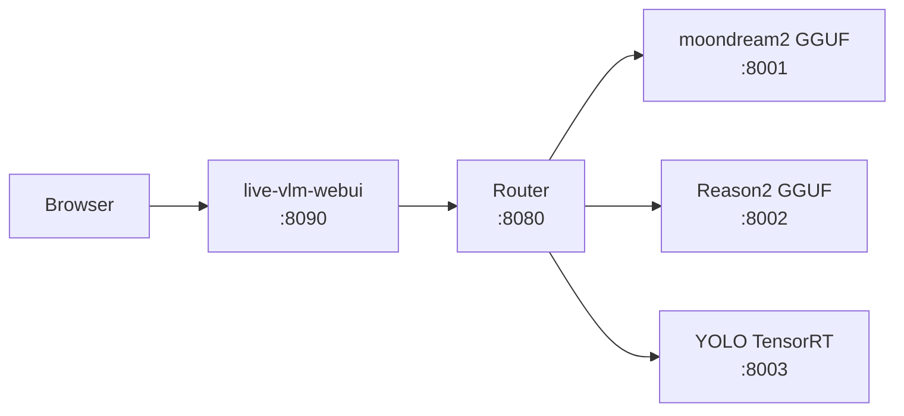

# Reason2 + moondream2 + YOLO GGUF Container Inference Platform

## Overview

Multi-model VLM inference on NVIDIA Jetson Orin Nano via Docker containers, using the jetson-containers ecosystem for CUDA management.

### 1. Architecture



### 2. Kiosk GUI & Headless Tool

A PySide6 kiosk GUI and headless pipeline validation tool are provided in `pyside6-gui/`.
See [pyside6-gui.md](pyside6-gui.md) for setup, UI design, and usage.

### 3. RTSP Server

CSI camera RTSP streaming via nvarguscamerasrc. See [rtsp-server.md](rtsp-server.md)
for pipeline, configuration, and troubleshooting.

### 4. Hardware Requirements

- **NVIDIA Jetson Orin Nano** (JetPack 6.2.1 / L4T R36.4.7)
- CUDA 12.6 (GPU Driver 540.4.0)
- RAM: 7.4GB
- Storage: 30GB+ free (Docker images ~20GB + models ~3.5GB)

## Prerequisites

### 1. Prepare SD Card

Download [JetPack 6.2.1 Super SD Card Image](https://developer.nvidia.com/downloads/embedded/L4T/r36_Release_v4.4/jp62-r1-orin-nano-sd-card-image.zip), flash with [balenaEtcher](https://github.com/balena-io/etcher/releases/download/v2.1.6/balenaEtcher-2.1.6.Setup.exe), insert, and boot.  Follow the on-screen setup.

### 2. SSH + Passwordless sudo

Generate an SSH key on your local machine and copy it to the Jetson:

```bash
# Generate key (local machine)
ssh-keygen -t ed25519 -C "you@example.com"

# Copy to Jetson (enter password on first prompt)
ssh-copy-id <user>@<jetson-ip>

# Login to verify passwordless access
ssh <user>@<jetson-ip>
```

On the Jetson, set up passwordless sudo so scripts don't prompt for passwords:

```bash
echo '<user> ALL=(ALL) NOPASSWD: ALL' | sudo tee /etc/sudoers.d/<user>
sudo chmod 440 /etc/sudoers.d/<user>
sudo visudo -c        # verify syntax

# Back to local machine
logout
```

### 3. Copy Project to Jetson

```bash
git clone git@github.com:ccbruce0812/nikko-vlm-webui.git
scp -r nikko-vlm-webui <user>@<jetson-ip>:~/
```

All subsequent operations happen inside `nikko-vlm-webui/` on the Jetson.

### 4. Update Stock Packages

On the Jetson:

```bash
# Back to remote machine
ssh <user>@<jetson-ip>

sudo apt-get update
sudo apt-get upgrade
```

### 5. Disable GUI

Jetson boots into graphical desktop by default (~500MB RAM consumed).
Switch to multi-user.target to free memory, but keep Xorg available for
nvarguscamerasrc (Argus requires a running X server for full-speed capture).

```bash
# Switch boot target to text mode
sudo systemctl set-default multi-user.target

# Allow Xorg to start under multi-user.target
sudo systemctl edit --full --force xorg.service << 'EOF'
[Unit]
Description=Xorg display server
After=multi-user.target

[Service]
ExecStart=/usr/bin/Xorg :0 -nolisten tcp -noreset
Restart=no

[Install]
WantedBy=multi-user.target
EOF
sudo systemctl enable xorg.service
```

After reboot, Xorg runs under multi-user.target. Set `DISPLAY=:0` before
using any GPU-accelerated GStreamer pipeline.

Verify that Xorg is working correctly:

```bash
# After reboot, check Xorg is running
pgrep Xorg && echo "Xorg OK"

# Optional: verify X11 rendering with xclock
export DISPLAY=:0
xclock &
```

> 📄 Script: `scripts/01-disable-gui.sh` (excludes manual verification above)

> **After completing System Configuration (step 6), test the CSI camera FPS:**
> ```bash
> export DISPLAY=:0
> sudo systemctl restart nvargus-daemon
> timeout 5 gst-launch-1.0 -v nvarguscamerasrc sensor-id=0 \
>     ! 'video/x-raw(memory:NVMM),width=1280,height=720,format=NV12,framerate=60/1' \
>     ! nvvidconv ! fpsdisplaysink video-sink=fakesink
> # Should show ~59 fps. Without DISPLAY, Argus caps at ~3 fps.
>
> timeout 5 gst-launch-1.0 -v nvarguscamerasrc sensor-id=0 \
>     ! 'video/x-raw(memory:NVMM),width=1920,height=1080,format=NV12,framerate=30/1' \
>     ! nvvidconv ! fpsdisplaysink video-sink=fakesink
> # Should show ~29 fps.
> ```

### 6. System Configuration

CSI camera (CAM0 / IMX219), Super Mode 25W, CMA tuning for maximizing GPU-available memory.

```bash
# Check current status
sudo nvpmodel -q
ls -la /dev/video* 2>/dev/null
cat /proc/meminfo | grep -E "^Cma|^MemAvailable"

# CSI camera — if /dev/video0 missing, configure via jetson-io.py
# sudo /opt/nvidia/jetson-io/jetson-io.py → IMX219 → CAM0 → Save & reboot

# Super Mode 25W — if not shown, delete old conf and reboot
sudo nvpmodel -q | grep -q "25W" || {
  sudo rm -rf /etc/nvpmodel.conf && sudo reboot
}

# MAXN Super + lock clocks
sudo nvpmodel -m 2
sudo jetson_clocks

# Kernel tuning
sudo sysctl -w vm.swappiness=10
sudo sysctl -w vm.vfs_cache_pressure=200
sudo sysctl -w vm.min_free_kbytes=65536

# Compact memory (maximize CMA)
sudo sync
sudo sysctl -w vm.drop_caches=3
sudo sysctl -w vm.compact_memory=1

# Verify
cat /proc/meminfo | grep -E "^Cma|^MemAvailable"
free -h
```

> 📄 Script: `scripts/02-system-config.sh` (run: `bash scripts/02-system-config.sh`)

### 7. Install Basic Packages

```bash
sudo apt-get install -y python3-venv v4l-utils libxcb-cursor0 python3-pip
```

> 📄 Script: `scripts/03-install-deps.sh`

## Model Download

Use `scripts/04-download-models.sh` for one-click download, or follow manual steps below:

### 1. Create venv and install dependencies

```bash
python3 -m venv /tmp/model-dl-venv
source /tmp/model-dl-venv/bin/activate
pip install huggingface_hub ultralytics onnx
```

### 2. Reason2 (IQ4_XS)

```bash
mkdir -p models/reason2
cd models/reason2

# LLM (IQ4_XS, ~970MB)
hf download mradermacher/Cosmos-Reason2-2B-heretic-GGUF \
    Cosmos-Reason2-2B-heretic.IQ4_XS.gguf --local-dir .

# mmproj (F16, ~782MB)
hf download apolo13x/Cosmos-Reason2-2B-GGUF \
    mmproj-Cosmos-Reason2-2B-F16.gguf --local-dir .

cd ../..
```

### 3. moondream2 (q4_k)

```bash
mkdir -p models/moondream2
cd models/moondream2

hf download salivosa/moondream2-gguf \
    moondream2-q4_k.gguf moondream2-mmproj-f16.gguf --local-dir .

cd ../..
```

### 4. YOLO (TensorRT)

Requires `.pt` model file. TensorRT engine is generated inside the Docker container
at first inference (the correct JetPack PyTorch is only available inside the container,
not in the download venv).

```bash
mkdir -p models/yolo
cd models/yolo

# Download YOLOv8n PyTorch model (~6.5MB)
python3 -c "
from ultralytics import YOLO
model = YOLO('yolov8n.pt')  # downloads to current dir
print('Downloaded yolov8n.pt')
"

cd ../..
```

### 5. Clean up venv

```bash
deactivate
rm -rf /tmp/model-dl-venv
```

> 📄 Script: `scripts/04-download-models.sh` (run: `bash scripts/04-download-models.sh`)

## Build Containers

### 1. Build Instructions

Model containers include Dockerfile, docker-compose.yml, and download script. Utility containers have only Dockerfile.

```bash
# Run from nikko-vlm-webui root

# Pull base image (L4T PyTorch)
sudo docker pull dustynv/l4t-pytorch:r36.4.0

# Router (API gateway, dynamic model detection, ~168MB)
sudo docker build -t router router/

# WebUI (official live-vlm-webui + GPU fix + API defaults, ~1.5GB)
sudo docker build -t live-vlm-webui live-vlm-webui/

# Reason2 (llama-server pre-built binaries, ~2GB)
sudo docker build -t reason2 -f reason2/Dockerfile .

# moondream2 (llama-server pre-built binaries, ~2GB)
sudo docker build -t moondream2 -f moondream2/Dockerfile .

# YOLO (PyTorch + ultralytics + TensorRT, ~13GB)
sudo docker build -t yolo yolo/

# RTSP Server (CSI camera streaming, optional, ~2GB)
sudo docker build -t rtsp-server rtsp-server/
```

> 📄 Script: `scripts/05-build-all.sh` (run: `bash scripts/05-build-all.sh`)

## Container Description

All containers on `vlm-net` bridged network.  Router and RTSP server also expose ports to host. Access via `localhost`, `127.0.0.1`, or Jetson LAN IP (e.g. `192.168.1.119`).

| Image | Container | Port | Accessible via | Purpose | API / Protocol |
|-------|-----------|------|---------------|---------|----------------|
| `router` | `router` | 8080 | host + vlm-net | API gateway, dynamic model detection | `GET http://<host>:8080/v1/models`<br>`POST http://<host>:8080/v1/chat/completions` |
| `moondream2` | `moondream2` | 8001 | vlm-net only | moondream2 GGUF inference (llama-server) | `POST http://<host>:8001/v1/chat/completions` — image + text → text |
| `reason2` | `reason2` | 8002 | vlm-net only | Reason2 GGUF inference (llama-server) | `POST http://<host>:8002/v1/chat/completions` — image + text → text |
| `yolo` | `yolo` | 8003 | vlm-net only | YOLOv8n PyTorch object detection | `POST http://<host>:8003/v1/chat/completions` — image → JSON `[{name, confidence, bbox}]` |
| `live-vlm-webui` | `live-vlm-webui` | 8090 | host (--network host) | Web frontend, WebRTC + RTSP relay | Browser `http://<host>:8090` → WebRTC (ICE/DTLS/SCTP/SRTP) |
| `rtsp-server` | `rtsp-server` | 8554 | host (--network host) | CSI camera RTSP stream (IMX219, nvarguscamerasrc → H.264) | `rtsp://<host>:8554/stream` — H.264 over RTP/UDP |

## Start Services

### 1. docker-compose

Three stacks, start/stop from their respective directories:

```bash
# Run from nikko-vlm-webui root

# Reason2 stack
(cd reason2 && sudo docker compose up -d)      # start
(cd reason2 && sudo docker compose down)       # stop

# or moondream2 stack
(cd moondream2 && sudo docker compose up -d)   # start
(cd moondream2 && sudo docker compose down)    # stop

# or YOLO stack
(cd yolo && sudo docker compose up -d)         # start
(cd yolo && sudo docker compose down)          # stop
```

> 📄 Start: `scripts/06-start-reason2.sh` / `08-start-moondream2.sh` / `10-start-yolo.sh`
> 📄 Stop: `scripts/07-stop-reason2.sh` / `09-stop-moondream2.sh` / `11-stop-yolo.sh`

### 2. Manual docker run

**Do NOT run multiple models simultaneously** (shared CMA memory; Orin Nano has only 7.4GB RAM).
The script prompts you to pick one model and optionally start RTSP Server.

```bash
bash scripts/12-start-manual.sh
```

Script flow:
1. Auto-starts Router + WebUI (required infrastructure)
2. Interactive model selection (Reason2 / moondream2 / YOLO — pick one)
3. Ask whether to start RTSP Server (CSI camera streaming, optional)

For individual manual control, reference commands below:

```bash
# Create shared network (once)
sudo docker network create vlm-net

# Router (required)
sudo docker run -d --name router --network vlm-net -p 8080:8080 router

# Pick one model (do NOT start multiple):
# Reason2 (~2.6GB GPU)
sudo docker run -d --name reason2 --runtime nvidia --network vlm-net \
    -v "$(pwd)/models/reason2:/model:ro" reason2

# moondream2 (~2.6GB GPU)
sudo docker run -d --name moondream2 --runtime nvidia --network vlm-net \
    -v "$(pwd)/models/moondream2:/model:ro" moondream2

# YOLO (~1.5GB GPU)
sudo docker run -d --name yolo --runtime nvidia --network vlm-net \
    -v "$(pwd)/models/yolo:/model:ro" yolo

# WebUI (required, host network)
sudo docker run -d --name live-vlm-webui --network host --runtime nvidia --privileged \
    -v /sys:/sys:ro -v /run/jtop.sock:/run/jtop.sock:ro live-vlm-webui

# RTSP Server (optional, CSI camera streaming)
sudo docker run -d --name rtsp-server --runtime nvidia --network host \
    --device=/dev/video0 --device=/dev/media0 \
    -v /tmp:/tmp \
    -e WIDTH=1280 -e HEIGHT=720 -e FPS=30 rtsp-server
```

> 📄 Script: `scripts/12-start-manual.sh` (run: `bash scripts/12-start-manual.sh`)
> 📄 Stop all: `scripts/13-stop-manual.sh`

## Manual Testing

All tests go through Router (port 8080). The only per-model difference is the `"model"` field.

### 1. Prepare Test Image (base64 encode)

```bash
# Generate test image with PIL or encode existing image
python3 -c "
import base64
with open('test.jpg', 'rb') as f:
    print(base64.b64encode(f.read()).decode())
" > /tmp/test_b64.txt
B64=$(cat /tmp/test_b64.txt)
```

### 2. Reason2 (image description)

```bash
curl -s http://localhost:8080/v1/chat/completions \
  -H "Content-Type: application/json" \
  -d "{
    \"model\": \"reason2\",
    \"messages\": [{\"role\":\"user\",\"content\":[
      {\"type\":\"text\",\"text\":\"Describe this image in one sentence.\"},
      {\"type\":\"image_url\",\"image_url\":{\"url\":\"data:image/jpeg;base64,$B64\"}}
    ]}],
    \"max_tokens\": 100
  }" | python3 -c "import sys,json; print(json.load(sys.stdin)['choices'][0]['message']['content'])"
```

### 3. moondream2 (image description)

```bash
curl -s http://localhost:8080/v1/chat/completions \
  -H "Content-Type: application/json" \
  -d "{
    \"model\": \"moondream2\",
    \"messages\": [{\"role\":\"user\",\"content\":[
      {\"type\":\"text\",\"text\":\"Describe this image in one sentence.\"},
      {\"type\":\"image_url\",\"image_url\":{\"url\":\"data:image/jpeg;base64,$B64\"}}
    ]}],
    \"max_tokens\": 100
  }" | python3 -c "import sys,json; print(json.load(sys.stdin)['choices'][0]['message']['content'])"
```

### 4. YOLO (object detection)

```bash
curl -s http://localhost:8080/v1/chat/completions \
  -H "Content-Type: application/json" \
  -d "{
    \"model\": \"yolo\",
    \"messages\": [{\"role\":\"user\",\"content\":[
      {\"type\":\"text\",\"text\":\"Detect objects\"},
      {\"type\":\"image_url\",\"image_url\":{\"url\":\"data:image/jpeg;base64,$B64\"}}
    ]}],
    \"max_tokens\": 200
  }" | python3 -c "import sys,json; print(json.load(sys.stdin)['choices'][0]['message']['content'])"
```

### 5. List Available Models

```bash
curl -s http://localhost:8080/v1/models | python3 -m json.tool
```

### 6. Quick Validation (using test/test_bus.jpg)

First checks `/v1/models` to see which models are running, then only tests available models.

```bash
# Query available models → test only running ones
python3 -c "
import base64, json, urllib.request, sys

# 1. Query which models are running
req = urllib.request.Request('http://localhost:8080/v1/models')
resp = json.loads(urllib.request.urlopen(req, timeout=10).read())
running = [m['id'] for m in resp.get('data', [])]
print(f'Router reports models: {running}')

if not running:
    print('⚠ No models running')
    sys.exit(0)

# 2. Read test image
with open('test/test_bus.jpg', 'rb') as f:
    b64 = base64.b64encode(f.read()).decode()

# 3. Test only models reported by Router (in fixed order)
for model in ['reason2', 'moondream2', 'yolo']:
    if model not in running:
        print(f'⊘ {model}: not running, skipped')
        continue

    prompt = 'Describe this image in one sentence.' if model != 'yolo' else 'Detect objects'
    data = json.dumps({
        'model': model,
        'messages': [{'role':'user','content':[
            {'type':'text','text':prompt},
            {'type':'image_url','image_url':{'url':f'data:image/jpeg;base64,{b64}'}}
        ]}],
        'max_tokens': 100
    }).encode()

    req = urllib.request.Request('http://localhost:8080/v1/chat/completions',
        data=data, headers={'Content-Type':'application/json'})
    resp = json.loads(urllib.request.urlopen(req, timeout=120).read())
    text = resp['choices'][0]['message']['content']
    print(f'✓ {model}: {text[:100]}')
"
```

> 📄 Script: `scripts/14-test-quick.sh` (run: `bash scripts/14-test-quick.sh`)

## Performance Data

| Metric | Reason2 IQ4_XS | moondream2 q4_k | YOLO |
|--------|----------------|-----------------|------|
| Model size | LLM 970MB + mmproj 782MB | LLM 877MB + mmproj 868MB | 6.5MB |
| Image size | ~2GB (pre-built binaries) | ~2GB (pre-built binaries) | 13.3GB |
| Build time | ~30 min (from source) | ~30 sec (binaries) | ~85 sec |
| Prompt speed | 72.9 tok/s | 299 tok/s | — |
| Generation speed | 19.5 tok/s | 22.7 tok/s | — |
| Chat Template | qwen3vl (native) | moondream2 custom Jinja | — |
| Purpose | VLM description | VLM description | Object detection |

## Memory Usage

| State | RAM Available | GPU Available |
|-------|--------------|---------------|
| Super Mode (25W) idle | 5.4 GiB | 5.4 GiB |
| Reason2 loaded | ~3.0 GiB | ~2.8 GiB |
| Reason2 + moondream2 together | ~1.5 GiB | ~0.5 GiB |

## Troubleshooting

### 1. reason2 fails to start: CUDA out of memory

- **When**: manually starting reason2 and yolo (or moondream2) simultaneously, not via docker-compose
- **Cause**: two models competing for GPU CMA memory; reason2 mmproj needs ~1.1GB
- **Fix**: stop other models, start reason2, then restore

```bash
sudo docker stop yolo
sudo docker start reason2
sleep 35
sudo docker start yolo
```

> 📄 Script: `scripts/15-troubleshoot-reason2-oom.sh`

### 1.1 Tuning Model Parameters (OOM or Performance)

All model parameters are pre-configured in Dockerfiles with Jetson Orin Nano optimized defaults. No changes normally needed.
To override, pass `-e` environment variables:

```bash
# Example: lower reason2 GPU layers to free memory
sudo docker run -d --name reason2 --runtime nvidia \
    -v "$(pwd)/models/reason2:/model:ro" \
    -e N_GPU_LAYERS=8 reason2

# Example: increase moondream2 ctx size for longer conversations
sudo docker run -d --name moondream2 --runtime nvidia \
    -v "$(pwd)/models/moondream2:/model:ro" \
    -e CTX_SIZE=2048 moondream2
```

| Container | Tunable Parameters (env vars) | Defaults |
|-----------|------------------------------|----------|
| reason2 | `N_GPU_LAYERS` `N_THREADS` `N_BATCH` `CTX_SIZE` `FLASH_ATTN` | 12 / 4 / 256 / 2048 / on |
| moondream2 | `N_GPU_LAYERS` `N_THREADS` `N_BATCH` `CTX_SIZE` `FLASH_ATTN` | 15 / 4 / 128 / 1024 / on |
| yolo | (no llama-server params) | — |

### 2. llama-server: libllama-server-impl.so not found

- **When**: only the `llama-server` binary was copied, not its dependent .so files
- **Cause**: llama-server dynamically links libllama-server-impl.so, libllama.so, etc.
- **Fix**: Dockerfile copies entire `build/bin/` directory and sets `LD_LIBRARY_PATH`

### 3. --flash-attn: unknown value

- **When**: using latest llama.cpp with bare `--flash-attn`
- **Cause**: newer llama.cpp requires explicit value `on|off|auto`
- **Fix**: use `--flash-attn on`

### 4. moondream2 returns blank

- **When**: calling moondream2 via OpenAI API format
- **Cause**: moondream2 is phi2 architecture; standard chat template is incompatible
- **Fix**: add custom `--chat-template`:

```
--chat-template "<image>\n\nQuestion: {{ part['text'] }}\n\nAnswer: {{ message['content'] }}"
```

### 5. WebUI GPU monitor always shows 0%

- **When**: using official live-vlm-webui image on Jetson
- **Cause**: Jetson uses shared memory; jtop returns GPU=0 in Docker containers
- **Fix**: built into `live-vlm-webui/Dockerfile` (patch_gpu_monitor.py)

### 6. WebUI camera not working

- **When**: WebUI using bridge network mode
- **Cause**: WebRTC needs direct UDP connection; Docker bridge NAT blocks it
- **Fix**: use `--network host` (already built into docker-compose.yml)

### 7. Disk space full

- **When**: too many Docker images accumulated
- **Cause**: base images + build cache consuming space
- **Fix**:

```bash
sudo docker system prune -af
```

> 📄 Script: `scripts/16-cleanup-disk.sh` (run: `bash scripts/16-cleanup-disk.sh`)

## File Structure

### Local / Remote (dev machine / Jetson, symmetric)

```
./
├── router/
│   ├── Dockerfile
│   └── router.py                 # dynamic model detection
├── reason2/
│   ├── Dockerfile                # llama-server from source
│   ├── docker-compose.yml        # reason2 + router + webui
│   └── download_model.sh         # IQ4_XS LLM + F16 mmproj
├── moondream2/
│   ├── Dockerfile                # llama-server pre-built binaries
│   ├── docker-compose.yml        # moondream2 + router + webui
│   └── download_model.sh         # q4_k LLM + f16 mmproj
├── yolo/
│   ├── Dockerfile                # PyTorch + ultralytics + TensorRT
│   ├── docker-compose.yml        # yolo + router + webui
│   ├── yolo_server.py            # OpenAI-compatible API server
│   └── download_model.sh         # YOLO → TensorRT engine export
├── live-vlm-webui/
│   ├── Dockerfile                # official live-vlm-webui + GPU fix + API defaults
│   └── patch_gpu_monitor.py      # Jetson GPU monitor fix
├── rtsp-server/
│   ├── Dockerfile                # GStreamer CSI RTSP server
│   └── gst_rtsp_server.py        # nvarguscamerasrc → nvvidconv → x264enc → RTSP
├── models/
│   ├── reason2/
│   ├── moondream2/
│   └── yolo/
├── test/
├── scripts/
│   ├── 01-disable-gui.sh               # disable GUI + enable Xorg via xorg.service
│   ├── 02-system-config.sh             # CSI camera + Super Mode 25W + NVMap + memory tuning
│   ├── 03-install-deps.sh              # install basic packages
│   ├── 04-download-models.sh           # download all models
│   ├── 05-build-all.sh                 # build all containers
│   ├── 06-start-reason2.sh             # start Reason2 stack
│   ├── 07-stop-reason2.sh              # stop Reason2
│   ├── 08-start-moondream2.sh          # start moondream2 stack
│   ├── 09-stop-moondream2.sh           # stop moondream2
│   ├── 10-start-yolo.sh                # start YOLO stack
│   ├── 11-stop-yolo.sh                 # stop YOLO
│   ├── 12-start-manual.sh              # interactive container launcher
│   ├── 13-stop-manual.sh               # stop all manually started containers
│   ├── 14-test-quick.sh                # quick model validation
│   ├── 15-troubleshoot-reason2-oom.sh  # Reason2 OOM fix
│   ├── 16-cleanup-disk.sh              # Docker disk cleanup
│   ├── 17-install-pyside6-gui.sh       # pyside6-gui venv + packages
│   ├── 18-start-pyside6-gui.sh         # launch kiosk GUI
│   ├── 19-start-pyside6-nogui.sh       # launch headless validation
│   ├── 20-start-rtsp-server.sh         # start RTSP Server (CSI camera, optional)
│   └── 21-stop-rtsp-server.sh          # stop RTSP Server
├── pyside6-gui/
│   ├── main.py                         # GUI entry point
│   ├── main_nogui.py                   # headless entry point
│   ├── assets/
│   │   └── style.qss                   # dark theme stylesheet
│   └── src/
│       ├── ui/
│       │   ├── kiosk_window.py
│       │   ├── video_display.py
│       │   └── control_sidebar.py
│       └── modules/
│           ├── video_source.py
│           ├── router_client.py
│           ├── yolo_overlay.py
│           ├── reason2_overlay.py
│           ├── moondream2_overlay.py
│           └── system_monitor.py
├── readme.md
├── pyside6-gui.md
├── rtsp-server.md
├── log.md
└── porting.md
```
