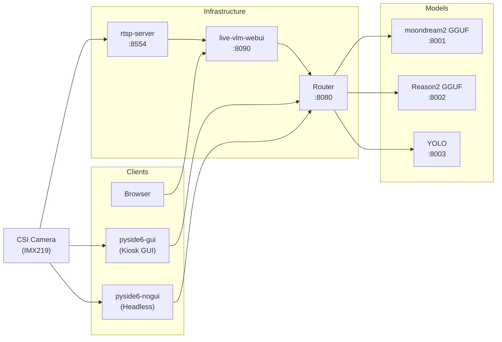

# Reason2 + moondream2 + YOLO GGUF Container Inference Platform

## Overview

Multi-model VLM inference on NVIDIA Jetson Orin Nano via Docker containers, using the jetson-containers ecosystem for CUDA management.

### 1. Architecture



### 2. Kiosk GUI & Headless Tool

A PySide6 kiosk GUI and headless pipeline validation tool are provided in `pyside6-gui/`.
See [pyside6-gui.md](pyside6-gui.md) for setup, UI design, and usage.

### 3. RTSP Server

CSI camera RTSP streaming via nvarguscamerasrc. See [rtsp-server.md](rtsp-server.md)
for pipeline, configuration, and troubleshooting.

### 4. Hardware Requirements

- **NVIDIA Jetson Orin Nano** (JetPack 6.2.1 / L4T R36.4.7)
- CUDA 12.6 (GPU Driver 540.4.0)
- RAM: 7.4GB
- Storage: 30GB+ free (Docker images ~20GB + models ~3.5GB)

## Prerequisites

### 1. Prepare SD Card

Download [JetPack 6.2.1 Super SD Card Image](https://developer.nvidia.com/downloads/embedded/L4T/r36_Release_v4.4/jp62-r1-orin-nano-sd-card-image.zip), flash with [balenaEtcher](https://github.com/balena-io/etcher/releases/download/v2.1.6/balenaEtcher-2.1.6.Setup.exe), insert, and boot.  Follow the on-screen setup.

### 2. SSH + Passwordless sudo

Generate an SSH key on your local machine and copy it to the Jetson:

```bash
# Generate key (local machine)
ssh-keygen -t ed25519 -C "you@example.com"

# Copy to Jetson (enter password on first prompt)
ssh-copy-id <user>@<jetson-ip>

# Login to verify passwordless access
ssh <user>@<jetson-ip>
```

On the Jetson, set up passwordless sudo so scripts don't prompt for passwords:

```bash
echo '<user> ALL=(ALL) NOPASSWD: ALL' | sudo tee /etc/sudoers.d/<user>
sudo chmod 440 /etc/sudoers.d/<user>
sudo visudo -c        # verify syntax

# Back to local machine
logout
```

### 3. Copy Project to Jetson

```bash
git clone git@github.com:ccbruce0812/nikko-vlm-webui.git
scp -r nikko-vlm-webui <user>@<jetson-ip>:~/
```

All subsequent operations happen inside `nikko-vlm-webui/` on the Jetson.

### 4. Update Stock Packages

On the Jetson:

```bash
# Back to remote machine
ssh <user>@<jetson-ip>

sudo apt-get update
sudo apt-get upgrade
```

### 5. Disable GUI

Jetson boots into graphical desktop by default (~500MB RAM consumed).
Switch to multi-user.target to free memory, but keep Xorg + openbox available for
GPU-accelerated applications (Argus requires Xorg, kiosk GUI requires a window manager).

```bash
# Install openbox (lightweight window manager)
sudo apt install -y openbox

# Switch boot target to text mode
sudo systemctl set-default multi-user.target

# Create xorg.service (Xorg under multi-user.target)
sudo tee /etc/systemd/system/xorg.service > /dev/null << 'EOF'
[Unit]
Description=Xorg display server
Before=openbox.service

[Service]
ExecStart=/usr/bin/Xorg :0 -nolisten tcp -noreset
Restart=no

[Install]
WantedBy=multi-user.target
EOF
sudo systemctl daemon-reload
sudo systemctl enable xorg.service

# Create openbox.service (window manager)
sudo tee /etc/systemd/system/openbox.service > /dev/null << EOF
[Unit]
Description=Openbox window manager
After=xorg.service
Requires=xorg.service

[Service]
Type=simple
ExecStart=/usr/bin/openbox
Environment=DISPLAY=:0
User=${USER}
Restart=no

[Install]
WantedBy=multi-user.target
EOF
sudo systemctl daemon-reload
sudo systemctl enable openbox.service

# Openbox RC: undecorated kiosk window
mkdir -p ~/.config/openbox
cat > ~/.config/openbox/rc.xml << 'RCEOF'
<?xml version="1.0" encoding="UTF-8"?>
<openbox_config>
  <keyboard>
    <chainQuitKey>C-g</chainQuitKey>
  </keyboard>
  <applications>
    <application name="Kiosk VLM GUI" class="main.py">
      <decor>no</decor>
    </application>
  </applications>
</openbox_config>
RCEOF
```

After reboot, Xorg and openbox run under multi-user.target. Set `DISPLAY=:0` before
using any GPU-accelerated GStreamer pipeline.

Verify that Xorg is working correctly:

```bash
# After reboot, check Xorg is running
pgrep Xorg && echo "Xorg OK"

# Optional: verify X11 rendering with xclock
export DISPLAY=:0
xclock &
```

> 📄 Script: `scripts/01-disable-gui.sh` (excludes manual verification above)

> **After completing System Configuration (step 6), test the CSI camera FPS:**
> ```bash
> export DISPLAY=:0
> sudo systemctl restart nvargus-daemon
> timeout 5 gst-launch-1.0 -v nvarguscamerasrc sensor-id=0 \
>     ! 'video/x-raw(memory:NVMM),width=1280,height=720,format=NV12,framerate=60/1' \
>     ! nvvidconv ! fpsdisplaysink video-sink=fakesink
> # Should show ~59 fps. Without DISPLAY, Argus caps at ~3 fps.
>
> timeout 5 gst-launch-1.0 -v nvarguscamerasrc sensor-id=0 \
>     ! 'video/x-raw(memory:NVMM),width=1920,height=1080,format=NV12,framerate=30/1' \
>     ! nvvidconv ! fpsdisplaysink video-sink=fakesink
> # Should show ~29 fps.
> ```

### 6. System Configuration

CSI camera (CAM0 / IMX219), Super Mode 25W, CMA tuning for maximizing GPU-available memory.

```bash
# Check current status
sudo nvpmodel -q
ls -la /dev/video* 2>/dev/null
cat /proc/meminfo | grep -E "^Cma|^MemAvailable"

# CSI camera — if /dev/video0 missing, configure via jetson-io.py
# sudo /opt/nvidia/jetson-io/jetson-io.py → IMX219 → CAM0 → Save & reboot

# Super Mode 25W — if not shown, delete old conf and reboot
sudo nvpmodel -q | grep -q "25W" || {
  sudo rm -rf /etc/nvpmodel.conf && sudo reboot
}

# MAXN Super + lock clocks
sudo nvpmodel -m 2
sudo jetson_clocks

# Kernel tuning
sudo sysctl -w vm.swappiness=10
sudo sysctl -w vm.vfs_cache_pressure=200
sudo sysctl -w vm.min_free_kbytes=65536

# Compact memory (maximize CMA)
sudo sync
sudo sysctl -w vm.drop_caches=3
sudo sysctl -w vm.compact_memory=1

# Verify
cat /proc/meminfo | grep -E "^Cma|^MemAvailable"
free -h
```

> 📄 Script: `scripts/02-system-config.sh` (run: `bash scripts/02-system-config.sh`)

### 7. Install Basic Packages

```bash
sudo apt-get install -y python3-venv v4l-utils libxcb-cursor0 python3-pip
```

> 📄 Script: `scripts/03-install-deps.sh`

## Model Download

Use `scripts/04-download-models.sh` for one-click download, or follow manual steps below:

### 1. Create venv and install dependencies

```bash
python3 -m venv /tmp/model-dl-venv
source /tmp/model-dl-venv/bin/activate
pip install huggingface_hub ultralytics onnx
```

### 2. Reason2 (IQ4_XS)

```bash
mkdir -p models/reason2
cd models/reason2

# LLM (IQ4_XS, ~970MB)
hf download mradermacher/Cosmos-Reason2-2B-heretic-GGUF \
    Cosmos-Reason2-2B-heretic.IQ4_XS.gguf --local-dir .

# mmproj (F16, ~782MB)
hf download apolo13x/Cosmos-Reason2-2B-GGUF \
    mmproj-Cosmos-Reason2-2B-F16.gguf --local-dir .

cd ../..
```

### 3. moondream2 (q4_k)

```bash
mkdir -p models/moondream2
cd models/moondream2

hf download salivosa/moondream2-gguf \
    moondream2-q4_k.gguf moondream2-mmproj-f16.gguf --local-dir .

cd ../..
```

### 4. YOLO (TensorRT)

Download the `.pt` model first, then optionally export to TensorRT for faster inference.
The server auto-detects: TensorRT engine if available, otherwise falls back to PyTorch.

```bash
mkdir -p models/yolo
cd models/yolo

# Download YOLOv8n PyTorch model (~6.5MB)
python3 -c "
from ultralytics import YOLO
model = YOLO('yolov8n.pt')  # downloads to current dir
print('Downloaded yolov8n.pt')
"

cd ../..
```

**Export to TensorRT (optional, 3–5 min):**

```bash
# After docker build, run once to generate .engine file:
sudo docker run --rm --runtime nvidia \
    -v "$(pwd)/models/yolo:/model" \
    -e EXPORT_ENGINE=1 yolo
```

The server picks TensorRT automatically on next start if `.engine` exists.

> 📄 Script: `scripts/04-download-models.sh` (downloads all models)

### 5. Clean up venv

```bash
deactivate
rm -rf /tmp/model-dl-venv
```

> 📄 Script: `scripts/04-download-models.sh` (run: `bash scripts/04-download-models.sh`)

## Build Containers

### 1. Build Instructions


```bash
# Run from nikko-vlm-webui root

# Pull base image (L4T PyTorch)
sudo docker pull dustynv/l4t-pytorch:r36.4.0

# Router (API gateway, dynamic model detection, ~168MB)
sudo docker build -t router router/

# WebUI (browser frontend, ~1.5GB) — see live-vlm-webui.md
sudo docker build -t live-vlm-webui live-vlm-webui/

# Reason2 (llama-server pre-built binaries, ~2GB)
sudo docker build -t reason2 -f reason2/Dockerfile .

# moondream2 (llama-server pre-built binaries, ~2GB)
sudo docker build -t moondream2 -f moondream2/Dockerfile .

# YOLO (PyTorch + ultralytics + TensorRT, ~13GB)
sudo docker build -t yolo yolo/

# RTSP Server (CSI camera streaming, optional, ~2GB)
sudo docker build -t rtsp-server rtsp-server/
```

> 📄 Script: `scripts/05-build-all.sh`

## Container Description

All containers on `vlm-net` bridged network.  Router and RTSP server also expose ports to host. Access via `localhost`, `127.0.0.1`, or Jetson LAN IP (e.g. `192.168.1.119`).

| Image | Container | Port | Accessible via | Purpose | API / Protocol |
|-------|-----------|------|---------------|---------|----------------|
| `router` | `router` | 8080 | host + vlm-net | API gateway, dynamic model detection | `GET http://<host>:8080/v1/models`<br>`POST http://<host>:8080/v1/chat/completions` |
| `moondream2` | `moondream2` | 8001 | vlm-net only | moondream2 GGUF inference (llama-server) | `POST http://<host>:8001/v1/chat/completions` — image + text → text |
| `reason2` | `reason2` | 8002 | vlm-net only | Reason2 GGUF inference (llama-server) | `POST http://<host>:8002/v1/chat/completions` — image + text → text |
| `yolo` | `yolo` | 8003 | vlm-net only | YOLOv8n object detection (TensorRT auto, PyTorch fallback) | `POST http://<host>:8003/v1/chat/completions` — image → JSON `[{name, confidence, bbox}]` |
| `live-vlm-webui` | `live-vlm-webui` | 8090 | host (--network host) | Web frontend, WebRTC + RTSP relay | Browser `http://<host>:8090` → WebRTC (ICE/DTLS/SCTP/SRTP). See [live-vlm-webui.md](live-vlm-webui.md). |
| `rtsp-server` | `rtsp-server` | 8554 | host (--network host) | CSI camera RTSP stream (IMX219, nvarguscamerasrc → H.264) | `rtsp://<host>:8554/stream` — H.264 over RTP/UDP |

## Start Services

### 1. Interactive Launcher (recommended)

```bash
bash scripts/06-start-models.sh
```

Starts Router (always), then interactively pick a model:
- **Reason2** or **moondream2** (VLM, mutually exclusive)
- **YOLO** (object detection, can run solo or paired with a VLM)
- Each VLM shows its default parameters (GPU layers, threads, batch, ctx, flash-attn) — press Enter to keep defaults or type new values
- Automatically handles power mode, nvargus-daemon restart, and memory tuning

> 📄 Start: `scripts/06-start-models.sh`
> 📄 Stop:  `scripts/07-stop-models.sh` (removes all containers + vlm-net)

### 2. Manual docker run

For individual control, reference commands:

```bash
# Create shared network (once)
sudo docker network create vlm-net

# Router (required)
sudo docker run -d --name router --network vlm-net -p 8080:8080 router

# Pick one model (do NOT start multiple VLM simultaneously):
# Reason2 (~2.6GB GPU)
sudo docker run -d --name reason2 --runtime nvidia --network vlm-net \
    -v "$(pwd)/models/reason2:/model:ro" reason2

# moondream2 (~2.6GB GPU)
sudo docker run -d --name moondream2 --runtime nvidia --network vlm-net \
    -v "$(pwd)/models/moondream2:/model:ro" moondream2

# YOLO (~1.5GB GPU, can co-exist with one VLM)
sudo docker run -d --name yolo --runtime nvidia --network vlm-net \
    -v "$(pwd)/models/yolo:/model:ro" yolo

# WebUI (host network) — see live-vlm-webui.md
# RTSP Server — see rtsp-server.md
```

## Manual Testing

All tests go through Router (port 8080). The only per-model difference is the `"model"` field.

### 1. Prepare Test Image (base64 encode)

```bash
# Generate test image with PIL or encode existing image
python3 -c "
import base64
with open('test.jpg', 'rb') as f:
    print(base64.b64encode(f.read()).decode())
" > /tmp/test_b64.txt
B64=$(cat /tmp/test_b64.txt)
```

### 2. Reason2 (image description)

```bash
curl -s http://localhost:8080/v1/chat/completions \
  -H "Content-Type: application/json" \
  -d "{
    \"model\": \"reason2\",
    \"messages\": [{\"role\":\"user\",\"content\":[
      {\"type\":\"text\",\"text\":\"Describe this image in one sentence.\"},
      {\"type\":\"image_url\",\"image_url\":{\"url\":\"data:image/jpeg;base64,$B64\"}}
    ]}],
    \"max_tokens\": 100
  }" | python3 -c "import sys,json; print(json.load(sys.stdin)['choices'][0]['message']['content'])"
```

### 3. moondream2 (image description)

```bash
curl -s http://localhost:8080/v1/chat/completions \
  -H "Content-Type: application/json" \
  -d "{
    \"model\": \"moondream2\",
    \"messages\": [{\"role\":\"user\",\"content\":[
      {\"type\":\"text\",\"text\":\"Describe this image in one sentence.\"},
      {\"type\":\"image_url\",\"image_url\":{\"url\":\"data:image/jpeg;base64,$B64\"}}
    ]}],
    \"max_tokens\": 100
  }" | python3 -c "import sys,json; print(json.load(sys.stdin)['choices'][0]['message']['content'])"
```

### 4. YOLO (object detection)

```bash
curl -s http://localhost:8080/v1/chat/completions \
  -H "Content-Type: application/json" \
  -d "{
    \"model\": \"yolo\",
    \"messages\": [{\"role\":\"user\",\"content\":[
      {\"type\":\"text\",\"text\":\"Detect objects\"},
      {\"type\":\"image_url\",\"image_url\":{\"url\":\"data:image/jpeg;base64,$B64\"}}
    ]}],
    \"max_tokens\": 200
  }" | python3 -c "import sys,json; print(json.load(sys.stdin)['choices'][0]['message']['content'])"
```

### 5. List Available Models

```bash
curl -s http://localhost:8080/v1/models | python3 -m json.tool
```

### 6. Quick Validation (using test/test_bus.jpg)

First checks `/v1/models` to see which models are running, then only tests available models.

```bash
# Query available models → test only running ones
python3 -c "
import base64, json, urllib.request, sys

# 1. Query which models are running
req = urllib.request.Request('http://localhost:8080/v1/models')
resp = json.loads(urllib.request.urlopen(req, timeout=10).read())
running = [m['id'] for m in resp.get('data', [])]
print(f'Router reports models: {running}')

if not running:
    print('⚠ No models running')
    sys.exit(0)

# 2. Read test image
with open('test/test_bus.jpg', 'rb') as f:
    b64 = base64.b64encode(f.read()).decode()

# 3. Test only models reported by Router (in fixed order)
for model in ['reason2', 'moondream2', 'yolo']:
    if model not in running:
        print(f'⊘ {model}: not running, skipped')
        continue

    prompt = 'Describe this image in one sentence.' if model != 'yolo' else 'Detect objects'
    data = json.dumps({
        'model': model,
        'messages': [{'role':'user','content':[
            {'type':'text','text':prompt},
            {'type':'image_url','image_url':{'url':f'data:image/jpeg;base64,{b64}'}}
        ]}],
        'max_tokens': 100
    }).encode()

    req = urllib.request.Request('http://localhost:8080/v1/chat/completions',
        data=data, headers={'Content-Type':'application/json'})
    resp = json.loads(urllib.request.urlopen(req, timeout=120).read())
    text = resp['choices'][0]['message']['content']
    print(f'✓ {model}: {text[:100]}')
"
```

> 📄 Script: `scripts/08-test-quick.sh` (run: `bash scripts/08-test-quick.sh`)

## Performance Data

| Metric | Reason2 IQ4_XS | moondream2 q4_k | YOLO |
|--------|----------------|-----------------|------|
| Model size | LLM 970MB + mmproj 782MB | LLM 877MB + mmproj 868MB | 6.5MB |
| Image size | ~2GB (pre-built binaries) | ~2GB (pre-built binaries) | 13.3GB |
| Build time | ~30 min (from source) | ~30 sec (binaries) | ~85 sec |
| Prompt speed | 72.9 tok/s | 299 tok/s | — |
| Generation speed | 19.5 tok/s | 22.7 tok/s | — |
| Chat Template | qwen3vl (native) | moondream2 custom Jinja | — |
| Purpose | VLM description | VLM description | Object detection |

## Memory Usage

| State | RAM Available | GPU Available |
|-------|--------------|---------------|
| Super Mode (25W) idle | 5.4 GiB | 5.4 GiB |
| Reason2 loaded | ~3.0 GiB | ~2.8 GiB |
| Reason2 + moondream2 together | ~1.5 GiB | ~0.5 GiB |

## Troubleshooting

### 1. Tuning Model Parameters (OOM or Performance)

All model parameters are pre-configured in Dockerfiles with Jetson Orin Nano optimized defaults. No changes normally needed.
To override, pass `-e` environment variables:

```bash
# Example: lower reason2 GPU layers to free memory
sudo docker run -d --name reason2 --runtime nvidia \
    -v "$(pwd)/models/reason2:/model:ro" \
    -e N_GPU_LAYERS=8 reason2

# Example: increase moondream2 ctx size for longer conversations
sudo docker run -d --name moondream2 --runtime nvidia \
    -v "$(pwd)/models/moondream2:/model:ro" \
    -e CTX_SIZE=2048 moondream2
```

| Container | Tunable Parameters (env vars) | Defaults |
|-----------|------------------------------|----------|
| reason2 | `N_GPU_LAYERS` `N_THREADS` `N_BATCH` `CTX_SIZE` `FLASH_ATTN` | 12 / 4 / 256 / 2048 / on |
| moondream2 | `N_GPU_LAYERS` `N_THREADS` `N_BATCH` `CTX_SIZE` `FLASH_ATTN` | 15 / 4 / 128 / 1024 / on |
| yolo | (no llama-server params) | — |

### 2. Freeing Disk Space and Memory

Jetson Orin Nano (8GB) has limited storage and unified memory. When space runs low,
Docker images, cached models, venvs, and CMA fragmentation all contribute.

**Clear accumulated artifacts:**

```bash
# Docker: remove unused images, containers, volumes, build cache
sudo docker system prune -af --volumes

# Models: re-download if needed (scripts/04-download-models.sh)
# rm -rf models/reason2 models/moondream2 models/yolo

# Python venv: rebuild if packages are stale
# rm -rf pyside6-gui-venv
# 11-start-pyside6-nogui.sh
```

**Release and compact memory:**

```bash
# Drop caches and compact — frees reclaimable slab/dentry/inode memory
sudo sync
echo 3 | sudo tee /proc/sys/vm/drop_caches
echo 1 | sudo tee /proc/sys/vm/compact_memory

# Check CMA allocation (Orin Nano uses CMA for GPU/ISP buffers)
cat /proc/meminfo | grep -i cma

# Verify swap is off (flash wear; Orin Nano should not swap)
sudo swapoff -a
```

**Large contiguous space (CMA):**

Docker + nvarguscamerasrc both allocate from CMA. If a model container fails to start
with "CUDA out of memory" or the camera pipeline reports "alloc failed", the CMA region
may be fragmented. Reboot is the most reliable fix:

```bash
sudo reboot
```

Alternatively, stop all containers and the camera pipeline, drop caches, then restart:

```bash
sudo docker stop $(sudo docker ps -q) 2>/dev/null
sudo systemctl stop nvargus-daemon
sudo sync && echo 3 | sudo tee /proc/sys/vm/drop_caches
echo 1 | sudo tee /proc/sys/vm/compact_memory
sudo systemctl start nvargus-daemon
```

## File Structure

### Local / Remote (dev machine / Jetson, symmetric)

```
./
├── router/
│   ├── Dockerfile
│   └── router.py                 # dynamic model detection
├── reason2/
│   ├── Dockerfile                # llama-server from source
│   └── download_model.sh         # IQ4_XS LLM + F16 mmproj
├── moondream2/
│   ├── Dockerfile                # llama-server pre-built binaries
│   └── download_model.sh         # q4_k LLM + f16 mmproj
├── yolo/
│   ├── Dockerfile                # PyTorch + ultralytics + TensorRT
│   ├── yolo_server.py            # OpenAI-compatible API server
│   └── download_model.sh         # YOLO → TensorRT engine export
├── live-vlm-webui/
│   ├── Dockerfile                # official live-vlm-webui + GPU fix + API defaults
│   └── patch_gpu_monitor.py      # Jetson GPU monitor fix
├── rtsp-server/
│   ├── Dockerfile                # GStreamer CSI RTSP server
│   └── gst_rtsp_server.py        # nvarguscamerasrc → nvvidconv → x264enc → RTSP
├── models/
│   ├── reason2/
│   ├── moondream2/
│   └── yolo/
├── test/
├── scripts/
│   ├── 01-disable-gui.sh               # disable GUI + enable Xorg/openbox
│   ├── 02-system-config.sh             # CSI camera + Super Mode 25W + NVMap + memory tuning
│   ├── 03-install-deps.sh              # install basic packages
│   ├── 04-download-models.sh           # download all models
│   ├── 05-build-all.sh                 # build all containers
│   ├── 06-start-models.sh              # interactive model launcher (router + model)
│   ├── 07-stop-models.sh               # stop all models + remove vlm-net
│   ├── 08-test-quick.sh                # quick model validation
│   ├── 09-install-pyside6-gui.sh       # pyside6-gui venv + packages
│   ├── 10-start-pyside6-gui.sh         # launch kiosk GUI
│   ├── 11-start-pyside6-nogui.sh       # launch headless validation
│   ├── 12-start-rtsp-server.sh         # start RTSP Server (CSI camera, optional)
│   ├── 13-stop-rtsp-server.sh          # stop RTSP Server
│   ├── 14-start-live-vlm-webui.sh      # start browser WebUI
│   └── 15-stop-live-vlm-webui.sh       # stop browser WebUI
├── pyside6-gui/
│   ├── main.py                         # GUI entry point
│   ├── main_nogui.py                   # headless entry point
│   ├── assets/
│   │   └── style.qss                   # dark theme stylesheet
│   └── src/
│       ├── ui/
│       │   ├── kiosk_window.py
│       │   ├── video_display.py
│       │   └── control_sidebar.py
│       └── modules/
│           ├── video_source.py
│           ├── router_client.py
│           ├── yolo_overlay.py
│           ├── reason2_overlay.py
│           ├── moondream2_overlay.py
│           └── system_monitor.py
├── readme.md
├── pyside6-gui.md
├── rtsp-server.md
├── live-vlm-webui.md
├── log.md
└── porting.md
```
