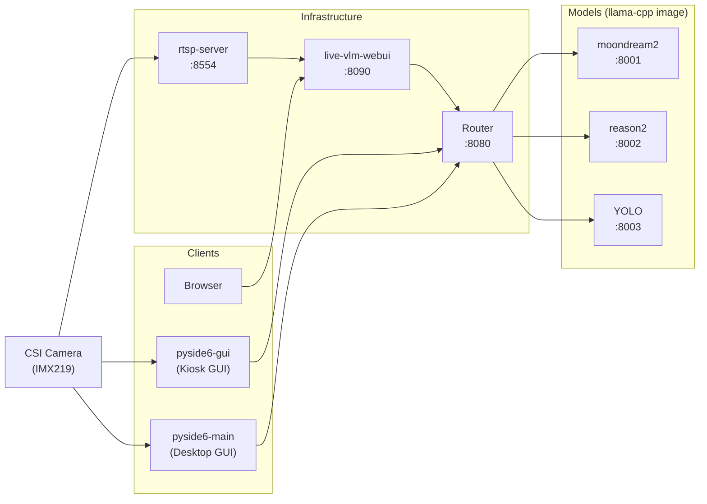

# Reason2 + moondream2 + YOLO GGUF Container Inference Platform

## Overview

Multi-model VLM inference on NVIDIA Jetson Orin Nano via Docker containers, using the jetson-containers ecosystem for CUDA management.

### 1. Hardware Requirements

- **NVIDIA Jetson Orin Nano** (JetPack 6.2.1 / L4T R36.4.7)
- CUDA 12.6 (GPU Driver 540.4.0)
- RAM: 7.4GB
- Storage: 30GB+ free (Docker images ~20GB + models ~3.5GB)

### 2. Architecture



### 3. GUI Tools

Two GUI frontends, both using the same Router API + Docker model backend:

| GUI | Mode | Description | Docs |
|-----|------|-------------|------|
| pyside6-gui | Kiosk (fullscreen) | Fullscreen control panel, OSD overlay, sidebar control | [pyside6-gui.md](pyside6-gui.md) |
| pyside6-main | Desktop (windowed) | Windowed control panel + AI popup, YOLO auto-detection | [pyside6-main.md](pyside6-main.md) |

### 4. Web UI Tools

Browser-based frontend with WebRTC live streaming:

| Tool | Description | Docs |
|------|-------------|------|
| live-vlm-webui | WebRTC browser UI, RTSP relay to CSI camera | [live-vlm-webui.md](live-vlm-webui.md) |

### 5. RTSP Server

CSI camera RTSP streaming via nvarguscamerasrc:

| Tool | Description | Docs |
|------|-------------|------|
| rtsp-server | A standard RTSP server | See [rtsp-server.md](rtsp-server.md) |

### 6. Models

See [Container Description](#2-container-description)

## Prerequisites

### 1. Prepare SD Card

- Download [JetPack 6.2.1 Super SD Card Image](https://developer.nvidia.com/downloads/embedded/L4T/r36_Release_v4.4/jp62-r1-orin-nano-sd-card-image.zip),
- Flash with [balenaEtcher](https://github.com/balena-io/etcher/releases/download/v2.1.6/balenaEtcher-2.1.6.Setup.exe),
- Insert, and boot.
- Follow the on-screen setup.

### 2. SSH + Passwordless sudo

Generate an SSH key on your local machine and copy it to the Jetson:

```bash
# Generate key (local machine)
ssh-keygen -t ed25519 -C "yourmail@example.com"

# Copy to Jetson (enter password on first prompt)
ssh-copy-id <user>@<jetson-ip>

# Login to verify passwordless access (now you are in remote machine)
ssh <user>@<jetson-ip>
```

On the Jetson, set up passwordless sudo so scripts don't prompt for passwords:

```bash
# Add a sudoer to the passwordless list
echo '<user> ALL=(ALL) NOPASSWD: ALL' | sudo tee /etc/sudoers.d/<user>
sudo chmod 440 /etc/sudoers.d/<user>

# Verify syntax
sudo visudo -c
```

### 3. Copy the working directory to Jetson

On the Jetson:

```bash
# Optional: SSH back to Jetson if disconnected 
ssh <user>@<jetson-ip>

git clone git@github.com:ccbruce0812/nikko-vlm-webui.git
```

### 4. Update Stock Packages

On the Jetson:

```bash
# Optional: SSH back to Jetson if disconnected
ssh <user>@<jetson-ip>

sudo apt-get update
sudo apt-get upgrade
```

### 5. Disable GUI

```bash
bash scripts/01-disable-gui.sh
```

Switches boot target to multi-user.target, installs openbox, creates xorg.service,
openbox.service, xterm.service, and configures kiosk window decor settings.
Reboot required after running.

> 📄 Script: `scripts/01-disable-gui.sh`

### 6. System Configuration

```bash
bash scripts/02-system-config.sh
```

Configures CSI camera (IMX219 CAM0), enables MAXN Super Mode (25W) with
jetson_clocks, and applies kernel memory tuning (swappiness, cache pressure,
CMA compaction).

> 📄 Script: `scripts/02-system-config.sh`

### 7. Install Basic Packages

```bash
bash scripts/03-install-deps.sh
```

Installs: python3-venv, v4l-utils, libxcb-cursor0, python3-pip.

> 📄 Script: `scripts/03-install-deps.sh`

## Model Download

```bash
bash scripts/04-download-models.sh
```

Downloads all models into `models/`: Reason2 (IQ4_XS, \~970MB LLM + 782MB mmproj),
moondream2 (q4_k, \~877MB LLM + 868MB mmproj), and YOLOv8n (~6.5MB .pt).

**Optional: Export YOLO to TensorRT** (after building the yolo Docker image):

```bash
sudo docker run --rm --runtime nvidia \
    -v "$(pwd)/models/yolo:/model" \
    yolo python3 make-engine.py
```

The server auto-detects the `.engine` file and uses TensorRT for faster inference.

> 📄 Script: `scripts/04-download-models.sh`

## Build Containers

### 1. Build Instructions

```bash
bash scripts/05-build-all.sh
```

Builds all containers from Dockerfiles: router, llama-cpp (reason2 + moondream2 share this image),\nyolo, live-vlm-webui, and rtsp-server. The base image `dustynv/l4t-pytorch:r36.4.0` is pulled once
for llama-cpp and yolo.

> 📄 Script: `scripts/05-build-all.sh`

### 2. Container Description

All containers on `vlm-net` bridged network.  Router and RTSP server also expose ports to host. Access via `localhost`, `127.0.0.1`, or Jetson LAN IP (e.g. `192.168.1.119`).

| Image | Container | Port | Accessible via | Purpose | API / Protocol |
|-------|-----------|------|---------------|---------|----------------|
| `router` | `router` | 8080 | host + vlm-net | API gateway, dynamic model detection | `GET http://<host>:8080/v1/models`<br>`POST http://<host>:8080/v1/chat/completions` |
| `llama-cpp` | `moondream2` | 8001 | vlm-net only | moondream2 GGUF inference (llama-server, shared image) | `POST http://<host>:8001/v1/chat/completions` — image + text → text |
| `llama-cpp` | `reason2` | 8002 | vlm-net only | reason2 GGUF inference (llama-server, shared image) | `POST http://<host>:8002/v1/chat/completions` — image + text → text |
| `yolo` | `yolo` | 8003 | vlm-net only | YOLOv8n object detection (TensorRT auto, PyTorch fallback) | `POST http://<host>:8003/v1/chat/completions` — image → JSON `[{name, confidence, bbox}]` |
| `live-vlm-webui` | `live-vlm-webui` | 8090 | host (--network host) | Web frontend, WebRTC + RTSP relay | Browser `http://<host>:8090` → WebRTC (ICE/DTLS/SCTP/SRTP). See [live-vlm-webui.md](live-vlm-webui.md). |
| `rtsp-server` | `rtsp-server` | 8554 | host (--network host) | CSI camera RTSP stream (IMX219, nvarguscamerasrc → H.264) | `rtsp://<host>:8554/stream` — H.264 over RTP/UDP |

## Start Services

### 1. Interactive Model Launcher (recommended)

```bash
bash scripts/06-start-models.sh
```

Starts Router (always), then interactively pick models:
- **reason2** and/or **moondream2** (VLM, share the same `llama-cpp` image, can run together)
- **YOLO** (object detection, can run solo or paired)
- Each model shows its default parameters — press Enter to keep defaults or type new values
- Automatically handles power mode, nvargus-daemon restart, and memory tuning

> 📄 Start: `scripts/06-start-models.sh`
> 📄 Stop: `scripts/07-stop-models.sh`

### 2. Quick Test

```bash
bash scripts/08-test-quick.sh
```

Queries Router for available models, then runs batch inferences across all running models\nusing 30 test images (`test/test_01.jpg` ~ `test/test_30.jpg`). Reports success/empty/error\ncounts per model.

> 📄 Script: `scripts/08-test-quick.sh`

### 3. Other Services

| Service | Docs |
|---------|------|
| live-vlm-webui (browser WebRTC UI) | [live-vlm-webui.md](live-vlm-webui.md) |
| rtsp-server (CSI RTSP stream) | [rtsp-server.md](rtsp-server.md) |

## Performance Data

Measured at 1920×1080@30 on Jetson Orin Nano, 30-image batch test:

| Metric | reason2 IQ4_XS | moondream2 q4_k | YOLO |
|--------|----------------|-----------------|------|
| Model size | LLM 970MB + mmproj 782MB | LLM 877MB + mmproj 868MB | 6.5MB |
| Inference time | ~9.6s (9126–10564ms) | ~5.9s (5524–6324ms) | ~135ms (87–331ms) |
| Token speed | prompt 135 tok/s, gen 10.6 tok/s | prompt 178 tok/s, gen 17.2 tok/s | — |
| Payload size | — | — | ~205–327 KB JPEG |
| Chat Template | qwen3vl (native) | `{{ message['content'] }}` Jinja | — |
| Purpose | VLM description | VLM description | Object detection |

## Memory Usage

| State | RAM Available | GPU Available |
|-------|--------------|---------------|
| Super Mode (25W) idle | 5.4 GiB | 5.4 GiB |
| Reason2 loaded | ~3.0 GiB | ~2.8 GiB |
| Reason2 + moondream2 together | ~1.5 GiB | ~0.5 GiB |

## Troubleshooting

### 1. Tuning Model Parameters (OOM or Performance)

Use the interactive launcher to set per-model parameters at startup:

```bash
bash scripts/06-start-models.sh
```

The script shows current defaults and lets you override before launching.
Default values (Jetson Orin Nano optimized):

| Container | Tunable Parameters | Defaults |
|-----------|-------------------|----------|
| reason2 | `GPU_LAYERS` `THREADS` `BATCH` `UBATCH` `CTX` `FLASH` `PARALLEL` `CACHE_K` `CACHE_V` `NO_CACHE_IDLE` | 12 / 4 / 64 / 32 / 2048 / on / 1 / q4_0 / q4_0 / on |
| moondream2 | `GPU_LAYERS` `THREADS` `BATCH` `UBATCH` `CTX` `FLASH` `CHAT_TEMPLATE` `PARALLEL` `CACHE_K` `CACHE_V` `NO_CACHE_IDLE` | 15 / 4 / 64 / 32 / 2048 / on / Question/Answer / 1 / q4_0 / q4_0 / on |
| yolo | (no llama-server params) | — |

### 2. Freeing Disk Space and Memory

Jetson Orin Nano (8GB) has limited storage and unified memory. When space runs low,
Docker images, cached models, venvs, and CMA fragmentation all contribute.

**Clear accumulated artifacts:**

```bash
# Docker: remove unused images, containers, volumes, build cache
sudo docker system prune -af --volumes

# Models: re-download if needed (scripts/04-download-models.sh)
# rm -rf models/reason2 models/moondream2 models/yolo

# Python venv: rebuild if packages are stale
# rm -rf pyside6-gui-venv pyside6-main-venv
```

**Release and compact memory:**

```bash
# Drop caches and compact — frees reclaimable slab/dentry/inode memory
sudo sync
echo 3 | sudo tee /proc/sys/vm/drop_caches
echo 1 | sudo tee /proc/sys/vm/compact_memory

# Check CMA allocation (Orin Nano uses CMA for GPU/ISP buffers)
cat /proc/meminfo | grep -i cma

# Verify swap is off (flash wear; Orin Nano should not swap)
sudo swapoff -a
```

**Large contiguous space (CMA):**

Docker + nvarguscamerasrc both allocate from CMA. If a model container fails to start
with "CUDA out of memory" or the camera pipeline reports "alloc failed", the CMA region
may be fragmented. Reboot is the most reliable fix:

```bash
sudo reboot
```

Alternatively, stop all containers and the camera pipeline, drop caches, then restart:

```bash
sudo docker stop $(sudo docker ps -q) 2>/dev/null
sudo systemctl stop nvargus-daemon
sudo sync && echo 3 | sudo tee /proc/sys/vm/drop_caches
echo 1 | sudo tee /proc/sys/vm/compact_memory
sudo systemctl start nvargus-daemon
```

## File Structure

### Local / Remote (dev machine / Jetson, symmetric)

```
./
├── router/
│   ├── Dockerfile
│   └── router.py
├── llama-cpp/
│   ├── Dockerfile
│   └── llama-cpp-binaries.tgz
├── yolo/
│   ├── Dockerfile
│   ├── server.py
│   └── make-engine.py
├── live-vlm-webui/
│   ├── Dockerfile
│   └── patch_gpu_monitor.py
├── rtsp-server/
│   ├── Dockerfile
│   └── gst_rtsp_server.py
├── models/
│   ├── reason2/
│   ├── moondream2/
│   └── yolo/
├── test/
│   ├── test_01.jpg
│   ⋮
│   └── test_30.jpg
├── scripts/
│   ├── 01-disable-gui.sh               # disable GUI + enable Xorg/openbox
│   ├── 02-system-config.sh             # CSI camera + Super Mode 25W + NVMap + memory tuning
│   ├── 03-install-deps.sh              # install basic packages
│   ├── 04-download-models.sh           # download all models
│   ├── 05-build-all.sh                 # build all containers
│   ├── 06-start-models.sh              # interactive model launcher (router + model)
│   ├── 07-stop-models.sh               # stop all models + remove vlm-net
│   ├── 08-test-quick.sh                # batch model validation (30 test images)
│   ├── 09-install-pyside6-gui.sh       # pyside6-gui venv + packages
│   ├── 10-start-pyside6-gui.sh         # launch kiosk GUI
│   ├── 11-start-rtsp-server.sh         # start RTSP Server (CSI camera, optional)
│   ├── 12-stop-rtsp-server.sh          # stop RTSP Server
│   ├── 13-start-live-vlm-webui.sh      # start browser WebUI
│   ├── 14-stop-live-vlm-webui.sh       # stop browser WebUI
│   ├── 15-install-pyside6-main.sh      # pyside6-main venv + packages
│   └── 16-start-pyside6-main.sh        # launch pyside6-main GUI
├── pyside6-gui/
│   ├── main.py
│   ├── assets/
│   │   └── style.qss
│   ├── util/
│   │   └── ram_monitor.py
│   └── src/
│       ├── ui/
│       │   ├── kiosk_window.py
│       │   ├── video_display.py
│       │   └── control_sidebar.py
│       └── modules/
│           ├── defaults.py
│           ├── video_source.py
│           ├── router_client.py
│           ├── yolo_overlay.py
│           ├── reason2_overlay.py
│           ├── moondream2_overlay.py
│           └── system_monitor.py
├── pyside6-main/
│   ├── main.py
│   └── src/
│       ├── ui/
│       │   ├── main_window.py
│       │   ├── ai_config_panel.py
│       │   ├── control_panel.py
│       │   └── video_canvas.py
│       └── modules/
│           ├── router_client.py
│           ├── yolo_overlay.py
│           ├── reason2_overlay.py
│           ├── moondream2_overlay.py
│           ├── video_worker.py
│           └── system_monitor.py
├── readme.md
├── pyside6-gui.md
├── pyside6-main.md
├── rtsp-server.md
└── live-vlm-webui.md
```
