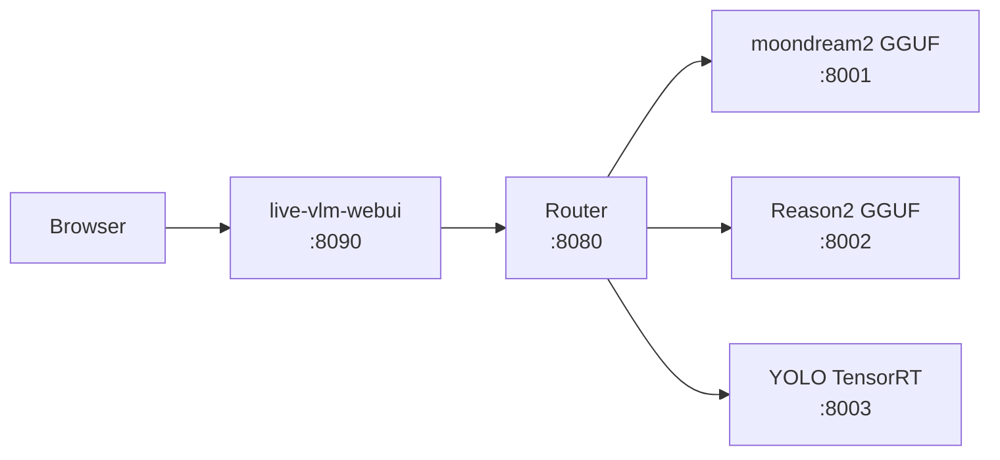

# Reason2 + moondream2 + YOLO GGUF 容器化推論平台

## 平台概述

在 NVIDIA Jetson Orin Nano 上透過 Docker 容器執行多個 VLM 模型推論，使用 jetson-containers 生態系統管理 CUDA 環境。

### 1. 架構



### 2. Router 動態模型偵測

Router 會自動探測後端容器狀態，`/v1/models` 只回傳實際運行的模型。

- 容器停止 → 自動從列表中移除
- 容器啟動 → 3 秒內自動出現
- WebUI 模型下拉選單即時反應

### 3. 硬體需求

- **NVIDIA Jetson Orin Nano** (JetPack 6.2.1 / L4T R36.4.7)
- CUDA 12.6 (GPU Driver 540.4.0)
- RAM: 7.4GB
- 儲存空間: 至少 30GB 可用（Docker 映像 ~20GB + 模型 ~3.5GB）

## 前置準備

### 1. 準備 SD 卡

從[JetPack 6.2.1 Super SD Card Image](https://developer.nvidia.com/downloads/embedded/L4T/r36_Release_v4.4/jp62-r1-orin-nano-sd-card-image.zip) 下載 Image 並且燒錄到 SD 卡。
用[balenaEtcher](https://github.com/balena-io/etcher/releases/download/v2.1.6/balenaEtcher-2.1.6.Setup.exe)燒錄，插入該 SD 卡開機。

### 2. 在Terminal中完成剩餘設定

- 在近端產生 SSH Key 並複製到遠端（免密碼登入）

產生 SSH Key

```bash
ssh-keygen -t ed25519 -C "your_email@example.com"
```

一路按 Enter 使用預設路徑即可：

```text
~/.ssh/id_ed25519
~/.ssh/id_ed25519.pub
```

將 Public Key 複製到遠端主機

```bash
ssh-copy-id user@remote_host
```

例如：

```bash
ssh-copy-id john@192.168.1.100
```

首次會要求輸入遠端使用者密碼。

- 測試免密碼登入

```bash
ssh user@remote_host
```

例如：

```bash
ssh john@192.168.1.100
```

若沒有 ssh-copy-id

手動複製：

```bash
cat ~/.ssh/id_ed25519.pub | ssh user@remote_host "mkdir -p ~/.ssh && chmod 700 ~/.ssh && cat >> ~/.ssh/authorized_keys && chmod 600 ~/.ssh/authorized_keys"
```

- 在遠端設定 sudoers，讓使用者執行 sudo 不需輸入密碼

編輯 sudoers：

```bash
sudo visudo
```

加入：

```text
username ALL=(ALL) NOPASSWD: ALL
```

例如：

```text
john ALL=(ALL) NOPASSWD: ALL
```

儲存後即可。

測試

```bash
sudo -k
sudo ls /root
```

若不再要求輸入密碼即設定成功。

建議使用 `/etc/sudoers.d/`

建立獨立設定檔：

```bash
echo 'john ALL=(ALL) NOPASSWD: ALL' | sudo tee /etc/sudoers.d/john
sudo chmod 440 /etc/sudoers.d/john
```

驗證：

```bash
sudo visudo -c
```

這種方式較容易管理且避免直接修改 `/etc/sudoers`。

此步驟以後，可使用 SSH 連入系統進行操作。不問密碼，不需 sudo。

### 3. 關閉圖形化登入

Jetson Orin Nano 預設開機進入圖形化桌面（graphical.target），會佔用 ~500MB RAM。
本平台全部透過 WebUI 操作，不需要本地桌面，切換為純文字模式可釋放記憶體給容器使用。

WiFi 連線由 NetworkManager 管理：NetworkManager 的 systemd unit 已設定
`WantedBy=multi-user.target`，切換 target 後 WiFi 會自動啟動，**不需要額外設定**。
以下指令同時確認 WiFi 狀態及啟用自動登入。

```bash
# 切換開機目標為 multi-user.target（關閉圖形化桌面）
sudo systemctl set-default multi-user.target

# 確認 NetworkManager 在 multi-user.target 下已啟用
sudo systemctl is-enabled NetworkManager
# 應回傳 "enabled"。若回傳 disabled / masked / static，手動啟用：
sudo systemctl enable NetworkManager

# 確認 WiFi 已設定自動連線
nmcli dev wifi list                          # 列出可用 WiFi
sudo nmcli dev wifi connect "SSID" password "YOUR_PASSWORD"
# 連線成功後 NetworkManager 會自動儲存，往後開機自動重連

# 重開機驗證
sudo reboot
# 開機後確認：WiFi 已連線（ping 外部）、docker 可用、RAM 釋放
```

> 📄 參考腳本：`scripts/01-disable-gui.sh`（可直接 `bash scripts/01-disable-gui.sh` 執行）

> **驗證清單**（reboot 後執行）：
> ```bash
> systemctl get-default             # → multi-user.target
> nmcli -t -f ACTIVE,SSID dev wifi  # → 應顯示 yes:你的SSID
> free -h                           # → available 應比原先多 ~400-500MB
> ```

### 4. 系統配置

Jetson Orin Nano 的 GPU 使用 CMA（Contiguous Memory Allocator）從系統 RAM 動態分配。

**CSI 攝影機**：CAM0 接 IMX219，透過 `jetson-io.py` 設定 device tree overlay。
設定後 `/dev/video0` 出現，供 rtsp-server 容器使用 nvarguscamerasrc 擷取即時影像。

**Super Mode 說明**：標準 MAXN 僅 15W；刷入 JetPack 6.1+ SD 卡映像後，刪除
`/etc/nvpmodel.conf` 並 reboot，系統會重新產生含 **25W MAXN** 的設定檔，
此即 NVIDIA 官方所稱的「Super Mode」（1.7x AI 效能提升）。

以下步驟依序：CSI 攝影機設定 → 檢查/啟用 Super Mode → MAXN (25W) → 鎖最高時脈 → 調整 NVMap/kernel 參數 → 清除碎片，
目標是**最大化 GPU 可用的連續記憶體**。

```bash
# 查看目前狀態
echo "=== 目前 nvpmodel 模式 ==="
sudo nvpmodel -q
echo ""
echo "=== CSI 攝影機狀態 ==="
ls -la /dev/video* 2>/dev/null || echo "  未偵測到 /dev/video*"
echo ""
echo "=== 目前 CMA / GPU 可用記憶體 ==="
cat /proc/meminfo | grep -E "^Cma|^MemAvailable"
free -h

# 設定 CSI 攝影機（CAM0 / IMX219）
# 若 /dev/video0 不存在，需用 jetson-io.py 設定 device tree overlay
if [ ! -e /dev/video0 ]; then
  echo "⚠ /dev/video0 不存在"
  echo "→ sudo /opt/nvidia/jetson-io/jetson-io.py"
  echo "  選擇 Configure for compatible camera → IMX219 → Save and reboot"
fi

# 檢查是否已啟用 Super Mode (25W)
# 若 nvpmodel -q 未顯示 25W 或 MAXN Super，需先刪除舊 nvpmodel.conf 並 reboot
sudo nvpmodel -q | grep -q "25W\|MAXN Super" || {
  echo "⚠ 目前僅支援標準 15W MAXN"
  echo "→ sudo rm -rf /etc/nvpmodel.conf && sudo reboot  # 刪除後重開機"
  echo "  (需先刷入 JetPack 6.1+ SD 卡映像，reboot 後系統自動產生 25W nvpmodel.conf)"
}

# 設定 MAXN Super Mode (25W)
sudo nvpmodel -m 2
echo "→ MAXN mode 2 (Super Mode 25W)"

# 鎖定最高時脈（CPU + GPU + EMC）
sudo jetson_clocks
echo "→ clocks locked"

# 調整 NVMap / kernel 參數（增加 CMA 可分配空間）
# 降低 swap 傾向：避免 GPU 資料被 swap 到 eMMC，保持 CMA 可用
sudo sysctl -w vm.swappiness=10
# 提高 cache 回收壓力：優先釋放 dentry/inode cache，騰出 RAM 給 CMA
sudo sysctl -w vm.vfs_cache_pressure=200
# 提高 vm.min_free_kbytes：保留更多連續 free page 供 CMA 分配
sudo sysctl -w vm.min_free_kbytes=65536
# 設定 NVMap external pool size：限制 GPU 用戶態記憶體池，防止耗盡 CMA
# （Orin Nano 無 ext_pool_size，此指令會失敗，可忽略）
sudo sh -c 'echo 1024 > /sys/kernel/debug/tegra_nvmap/ext_pool_size' 2>/dev/null || true

# 清除記憶體碎片（最大化 CMA 連續區塊）
sudo sync
sudo sysctl -w vm.drop_caches=3
sudo sysctl -w vm.compact_memory=1

# 驗證
echo ""
echo "=== 調整後 CMA / GPU 可用記憶體 ==="
cat /proc/meminfo | grep -E "^Cma|^MemAvailable"
free -h
echo ""
echo "nvpmodel 模式: $(sudo nvpmodel -q | grep 'NV Power Mode')"
```

> 📄 參考腳本：`scripts/02-system-config.sh`（可直接 `bash scripts/02-system-config.sh` 執行）

### 5. 安裝基本套件

```bash
# Docker 應已預裝（JetPack 6.x）
# 確認 nvidia-container-runtime
sudo docker info | grep Runtime

# 安裝 python3-venv（模型下載腳本需要）
sudo apt-get install -y python3-venv
```

> 📄 參考腳本：`scripts/03-install-deps.sh`（可直接 `bash scripts/03-install-deps.sh` 執行）

## 模型下載

使用 `scripts/04-download-models.sh` 一鍵下載，或手動依以下步驟操作：

### 1. 建立 venv 並安裝依賴

```bash
python3 -m venv /tmp/model-dl-venv
source /tmp/model-dl-venv/bin/activate
pip install huggingface_hub ultralytics onnx
```

### 2. Reason2 (IQ4_XS 量化)

```bash
mkdir -p models/reason2
cd models/reason2

# LLM (IQ4_XS, ~970MB)
hf download mradermacher/Cosmos-Reason2-2B-heretic-GGUF \
    Cosmos-Reason2-2B-heretic.IQ4_XS.gguf --local-dir .

# mmproj (F16, ~782MB)
hf download apolo13x/Cosmos-Reason2-2B-GGUF \
    mmproj-Cosmos-Reason2-2B-F16.gguf --local-dir .

cd ../..
```

### 3. moondream2 (q4_k 量化)

```bash
mkdir -p models/moondream2
cd models/moondream2

hf download salivosa/moondream2-gguf \
    moondream2-q4_k.gguf moondream2-mmproj-f16.gguf --local-dir .

cd ../..
```

### 4. YOLO (TensorRT)

需 Jetson GPU，匯出時使用 `quantize=16`（FP16）。

```bash
mkdir -p models/yolo
cd models/yolo

# 下載 YOLOv8n PyTorch 模型（~6.5MB）
python3 -c "
from ultralytics import YOLO
model = YOLO('yolov8n.pt')
import shutil
shutil.move('yolov8n.pt', '.')
print('Downloaded yolov8n.pt')
"

# 匯出 TensorRT engine（FP16，~13MB）
python3 -c "
from ultralytics import YOLO
model = YOLO('yolov8n.pt')
model.export(format='engine', device=0, quantize=16, imgsz=640)
import shutil
shutil.move('yolov8n.engine', '.')
print('TensorRT engine exported')
"

cd ../..
```

### 5. 清理 venv

```bash
deactivate
rm -rf /tmp/model-dl-venv
```

> 📄 參考腳本：`scripts/04-download-models.sh`（可直接 `bash scripts/04-download-models.sh` 執行）

## 建置容器

### 1. 建置說明

模型類容器內含 Dockerfile、docker-compose.yml、下載腳本。但功能類的容器就只有Dockerfile。

```bash
# 進入專案目錄
# 在 nikko-vlm-webui 根目錄執行

# 拉取基礎映像（L4T PyTorch）
sudo docker pull dustynv/l4t-pytorch:r36.4.0

# Router（API 閘道，動態模型偵測，~168MB）
sudo docker build -t router router/

# WebUI（官方 live-vlm-webui + GPU fix + API 預設，~1.5GB）
sudo docker build -t live-vlm-webui live-vlm-webui/

# Reason2（llama-server pre-built binaries，~2GB）
sudo docker build -t reason2 -f reason2/Dockerfile .

# moondream2（llama-server pre-built binaries，~2GB）
sudo docker build -t moondream2 -f moondream2/Dockerfile .

# YOLO（PyTorch + ultralytics + TensorRT，~13GB）
sudo docker build -t yolo yolo/

# RTSP Server（CSI 攝影機串流，選用，~2GB）
sudo docker build -t rtsp-server rtsp-server/
```

> 📄 參考腳本：`scripts/05-build-all.sh`（可直接 `bash scripts/05-build-all.sh` 執行）

### 2. Image ↔ Container 對照表

| Image | Container | Port | 用途 |
|-------|-----------|------|------|
| `router` | `router` | 8080 | API 閘道，動態模型偵測 |
| `moondream2` | `moondream2` | 8001 | moondream2 GGUF 推論 |
| `reason2` | `reason2` | 8002 | Reason2 GGUF 推論 |
| `yolo` | `yolo` | 8003 | YOLO TensorRT 物體偵測 |
| `live-vlm-webui` | `live-vlm-webui` | 8090 | Web 前端，WebRTC 鏡頭 |
| `rtsp-server` | `rtsp-server` | 8554 | CSI 攝影機 RTSP 串流（IMX219 / CAM0） |

## 啟動服務

### 1. docker-compose

三種組合，各自從對應目錄啟動/停止：

```bash
# 在 nikko-vlm-webui 根目錄執行

# Reason2 組合
(cd reason2 && sudo docker compose up -d)      # 啟動
(cd reason2 && sudo docker compose down)       # 停止

# 或 moondream2 組合
(cd moondream2 && sudo docker compose up -d)   # 啟動
(cd moondream2 && sudo docker compose down)    # 停止

# 或 YOLO 組合
(cd yolo && sudo docker compose up -d)         # 啟動
(cd yolo && sudo docker compose down)          # 停止
```

> 📄 啟動：`scripts/06-start-reason2.sh` / `08-start-moondream2.sh` / `10-start-yolo.sh`
> 📄 停止：`scripts/07-stop-reason2.sh` / `09-stop-moondream2.sh` / `11-stop-yolo.sh`

### 2. 手動 docker run（推薦 — 互動式腳本）

三個模型**不可同時啟動**（共用 CMA 記憶體，Orin Nano 僅 7.4GB RAM）。
腳本會讓使用者任選一個模型，並可選用 RTSP Server。

```bash
bash scripts/12-start-manual.sh
```

腳本流程：
1. 自動啟動 Router + WebUI（必要基礎設施）
2. 互動選擇模型（Cosmos / moondream2 / YOLO 三選一）
3. 詢問是否啟動 RTSP Server（CSI 攝影機串流，選用）

若需個別手動控制，參考以下指令：

```bash
# 建立共用網路（只需執行一次）
sudo docker network create vlm-net

# Router（必要）
sudo docker run -d --name router --network vlm-net -p 8080:8080 router

# 選擇一個模型（不可同時啟動多個）：
# Cosmos（~2.6GB GPU）
sudo docker run -d --name reason2 --runtime nvidia --network vlm-net \
    -v "$(pwd)/models/reason2:/model:ro" reason2

# moondream2（~2.6GB GPU）
sudo docker run -d --name moondream2 --runtime nvidia --network vlm-net \
    -v "$(pwd)/models/moondream2:/model:ro" moondream2

# YOLO（~1.5GB GPU）
sudo docker run -d --name yolo --runtime nvidia --network vlm-net \
    -v "$(pwd)/models/yolo:/model:ro" yolo

# WebUI（必要，host 網路）
sudo docker run -d --name live-vlm-webui --network host --runtime nvidia --privileged \
    -v /sys:/sys:ro -v /run/jtop.sock:/run/jtop.sock:ro live-vlm-webui

# RTSP Server（選用，CSI 攝影機串流）
sudo docker run -d --name rtsp-server --runtime nvidia --network host \
    --device=/dev/video0 --device=/dev/media0 \
    -v /tmp:/tmp \
    -e WIDTH=1280 -e HEIGHT=720 -e FPS=30 rtsp-server
```

> 📄 參考腳本：`scripts/12-start-manual.sh`（可直接 `bash scripts/12-start-manual.sh` 執行）
> 📄 停止全部：`scripts/13-stop-manual.sh`

## 手動測試

所有測試透過 Router（port 8080）統一入口。模型差異只有 `"model"` 欄位。

### 1. 準備測試圖片（base64 編碼）

```bash
# 用 PIL 產生測試圖或編碼現有圖片
python3 -c "
import base64
with open('test.jpg', 'rb') as f:
    print(base64.b64encode(f.read()).decode())
" > /tmp/test_b64.txt
B64=$(cat /tmp/test_b64.txt)
```

### 2. Reason2（影像描述）

```bash
curl -s http://localhost:8080/v1/chat/completions \
  -H "Content-Type: application/json" \
  -d "{
    \"model\": \"reason2\",
    \"messages\": [{\"role\":\"user\",\"content\":[
      {\"type\":\"text\",\"text\":\"Describe this image in one sentence.\"},
      {\"type\":\"image_url\",\"image_url\":{\"url\":\"data:image/jpeg;base64,$B64\"}}
    ]}],
    \"max_tokens\": 100
  }" | python3 -c "import sys,json; print(json.load(sys.stdin)['choices'][0]['message']['content'])"
```

### 3. moondream2（影像描述）

```bash
curl -s http://localhost:8080/v1/chat/completions \
  -H "Content-Type: application/json" \
  -d "{
    \"model\": \"moondream2\",
    \"messages\": [{\"role\":\"user\",\"content\":[
      {\"type\":\"text\",\"text\":\"Describe this image in one sentence.\"},
      {\"type\":\"image_url\",\"image_url\":{\"url\":\"data:image/jpeg;base64,$B64\"}}
    ]}],
    \"max_tokens\": 100
  }" | python3 -c "import sys,json; print(json.load(sys.stdin)['choices'][0]['message']['content'])"
```

### 4. YOLO（物體偵測，TensorRT）

```bash
curl -s http://localhost:8080/v1/chat/completions \
  -H "Content-Type: application/json" \
  -d "{
    \"model\": \"yolo\",
    \"messages\": [{\"role\":\"user\",\"content\":[
      {\"type\":\"text\",\"text\":\"Detect objects\"},
      {\"type\":\"image_url\",\"image_url\":{\"url\":\"data:image/jpeg;base64,$B64\"}}
    ]}],
    \"max_tokens\": 200
  }" | python3 -c "import sys,json; print(json.load(sys.stdin)['choices'][0]['message']['content'])"
```

### 5. 查看可用模型清單

```bash
curl -s http://localhost:8080/v1/models | python3 -m json.tool
```

### 6. 快速驗證（使用 test/test_bus.jpg）

先查 Router 的 `/v1/models` 確認哪些模型正在運行，只測試實際存在的模型，未運行的自動跳過。

```bash
# 查詢可用模型 → 只測運行的
python3 -c "
import base64, json, urllib.request, sys

# 1. 查詢目前有哪些模型在運行
req = urllib.request.Request('http://localhost:8080/v1/models')
resp = json.loads(urllib.request.urlopen(req, timeout=10).read())
running = [m['id'] for m in resp.get('data', [])]
print(f'Router 回報模型: {running}')

if not running:
    print('⚠ 沒有任何模型在運行')
    sys.exit(0)

# 2. 讀取測試圖片
with open('test/test_bus.jpg', 'rb') as f:
    b64 = base64.b64encode(f.read()).decode()

# 3. 只測試 Router 回報的模型（照固定順序）
for model in ['reason2', 'moondream2', 'yolo']:
    if model not in running:
        print(f'⊘ {model}: 未運行，跳過')
        continue

    prompt = 'Describe this image in one sentence.' if model != 'yolo' else 'Detect objects'
    data = json.dumps({
        'model': model,
        'messages': [{'role':'user','content':[
            {'type':'text','text':prompt},
            {'type':'image_url','image_url':{'url':f'data:image/jpeg;base64,{b64}'}}
        ]}],
        'max_tokens': 100
    }).encode()

    req = urllib.request.Request('http://localhost:8080/v1/chat/completions',
        data=data, headers={'Content-Type':'application/json'})
    resp = json.loads(urllib.request.urlopen(req, timeout=120).read())
    text = resp['choices'][0]['message']['content']
    print(f'✓ {model}: {text[:100]}')
"
```

> 📄 參考腳本：`scripts/16-test-quick.sh`（可直接 `bash scripts/16-test-quick.sh` 執行）

## 效能數據

| 指標 | Reason2 IQ4_XS | moondream2 q4_k | YOLO |
|------|--------------------------|-----------------|---------|
| 模型大小 | LLM 970MB + mmproj 782MB | LLM 877MB + mmproj 868MB | 6.5MB |
| 容器大小 | ~2GB (pre-built wheel) | ~2GB (pre-built wheel) | 13.3GB |
| 建置時間 | ~2 分鐘 (pip install) | ~2 分鐘 (pip install) | ~85 秒 |
| Prompt 速度 | 72.9 tok/s | 299 tok/s | — |
| Generation 速度 | 19.5 tok/s | 22.7 tok/s | — |
| Chat Template | qwen3vl (原生) | moondream2 自訂 Jinja | — |
| 用途 | VLM 描述 | VLM 描述 | 物體偵測 |

## 記憶體使用

| 狀態 | RAM 可用 | GPU 可用 |
|------|---------|---------|
| Super Mode (25W) 後 (空閒) | 5.4 GiB | 5.4 GiB |
| Cosmos 載入後 | ~3.0 GiB | ~2.8 GiB |
| Cosmos + moondream2 同時 | ~1.5 GiB | ~0.5 GiB |

## 疑難排解

### 1. reason2 啟動失敗：CUDA out of memory

- **何時發生**：手動同時啟動 reason2 與 yolo（或 moondream2），不在 docker-compose 情境
- **原因**：兩個模型同時搶 GPU CMA 記憶體，reason2 的 mmproj 需要 ~1.1GB
- **解法**：先停其他模型，啟動 reason2，再恢復

```bash
sudo docker stop yolo
sudo docker start reason2
sleep 35
sudo docker start yolo
```

> 📄 參考腳本：`scripts/17-troubleshoot-reason2-oom.sh`（可直接 `bash scripts/17-troubleshoot-reason2-oom.sh` 執行）

### 1.1 微調模型參數（OOM 或效能調校）

所有模型參數已在 Dockerfile 以 Jetson Orin Nano 最佳化預設值寫入，正常不需修改。
若仍需覆寫，透過 `-e` 傳入環境變數：

```bash
# 範例：降低 reason2 GPU 層數以釋放記憶體
sudo docker run -d --name reason2 --runtime nvidia \
    -v "$(pwd)/models/reason2:/model:ro" \
    -e N_GPU_LAYERS=8 reason2

# 範例：提高 moondream2 ctx size 處理較長對話
sudo docker run -d --name moondream2 --runtime nvidia \
    -v "$(pwd)/models/moondream2:/model:ro" \
    -e CTX_SIZE=2048 moondream2
```

| 容器 | 可調參數（環境變數） | 預設值 |
|------|---------------------|--------|
| reason2 | `N_GPU_LAYERS` `N_THREADS` `N_BATCH` `CTX_SIZE` `FLASH_ATTN` | 12 / 4 / 256 / 2048 / on |
| moondream2 | `N_GPU_LAYERS` `N_THREADS` `N_BATCH` `CTX_SIZE` `FLASH_ATTN` | 15 / 4 / 128 / 1024 / off |
| yolo | （無 llama-server 參數） | — |

### 2. llama-server: libllama-server-impl.so not found

- **何時發生**：只複製 `llama-server` 二進位檔，未複製相依的 .so
- **原因**：llama-server 動態連結 libllama-server-impl.so、libllama.so 等
- **解法**：Dockerfile 內複製整個 `build/bin/` 目錄並設定 `LD_LIBRARY_PATH`

### 3. --flash-attn: unknown value

- **何時發生**：使用最新 llama.cpp，`--flash-attn` 不加參數
- **原因**：新版 llama.cpp 要求明確值 `on|off|auto`
- **解法**：改為 `--flash-attn on`

### 4. moondream2 回傳空白

- **何時發生**：透過 OpenAI API 格式呼叫 moondream2
- **原因**：moondream2 是 phi2 架構，標準 chat template 不相容
- **解法**：加上自訂 `--chat-template`：

```
--chat-template "<image>\n\nQuestion: {{ part['text'] }}\n\nAnswer: {{ message['content'] }}"
```

### 5. WebUI GPU 監測永遠 0%

- **何時發生**：在 Jetson 上使用官方 live-vlm-webui 映像
- **原因**：Jetson 共用記憶體，VRAM 永遠回傳 0，觸發 nvidia-smi fallback
- **解法**：已內建於 `live-vlm-webui/Dockerfile`（patch_gpu_monitor.py）

### 6. WebUI 鏡頭閃退

- **何時發生**：WebUI 用 bridge 網路模式時
- **原因**：WebRTC 需要直接 UDP 連線，Docker bridge NAT 會阻擋
- **解法**：改用 `--network host`（已內建於 docker-compose.yml）

### 7. 磁碟空間不足

- **何時發生**：Docker 映像累積過多
- **原因**：基礎映像 + 編譯快取佔用大量空間
- **解法**：

```bash
sudo docker system prune -af
```

> 📄 參考腳本：`scripts/18-cleanup-disk.sh`（可直接 `bash scripts/18-cleanup-disk.sh` 執行）

## 檔案結構

### 近端 / 遠端（開發機 / Jetson，結構對稱）

```
./
├── router/
│   ├── Dockerfile
│   └── router.py                 # 動態模型偵測
├── reason2/
│   ├── Dockerfile                # llama-cpp-python wheel + Python server
│   ├── docker-compose.yml        # reason2 + router + webui
│   └── download_model.sh         # IQ4_XS LLM + F16 mmproj
├── moondream2/
│   ├── Dockerfile                # llama-cpp-python wheel + Python server
│   ├── docker-compose.yml        # moondream2 + router + webui
│   └── download_model.sh         # q4_k LLM + f16 mmproj
├── yolo/
│   ├── Dockerfile                # PyTorch + ultralytics + TensorRT
│   ├── docker-compose.yml        # yolo + router + webui
│   ├── yolo_server.py            # OpenAI-compatible API server
│   └── download_model.sh         # YOLO → TensorRT engine 匯出
├── live-vlm-webui/
│   ├── Dockerfile                # 官方 live-vlm-webui + GPU fix + API 預設
│   └── patch_gpu_monitor.py      # Jetson GPU 監測修復
├── rtsp-server/
│   ├── Dockerfile                # GStreamer CSI RTSP server
│   └── gst_rtsp_server.py        # nvarguscamerasrc → nvvidconv → x264enc → RTSP
├── models/
│   ├── reason2/
│   ├── moondream2/
│   └── yolo/
├── test/
├── scripts/
│   ├── 01-disable-gui.sh               # 關閉圖形化登入 + WiFi + 自動登入
│   ├── 02-system-config.sh             # 系統配置（CSI 攝影機 + Super Mode 25W + NVMap + 記憶體優化）
│   ├── 03-install-deps.sh              # 安裝基本套件（Docker + jetson-containers + huggingface_hub）
│   ├── 04-download-models.sh           # 下載所有模型（Cosmos + moondream2 + YOLO）
│   ├── 05-build-all.sh                 # 建置全部容器（含拉取基礎映像）
│   ├── 06-start-reason2.sh             # 啟動 Reason2 組合
│   ├── 07-stop-reason2.sh              # 停止 Reason2
│   ├── 08-start-moondream2.sh          # 啟動 moondream2 組合
│   ├── 09-stop-moondream2.sh           # 停止 moondream2
│   ├── 10-start-yolo.sh                # 啟動 YOLO 組合
│   ├── 11-stop-yolo.sh                 # 停止 YOLO
│   ├── 12-start-manual.sh              # 手動 docker run（互動式）
│   ├── 13-stop-manual.sh               # 停止所有手動啟動的容器
│   ├── 14-start-rtsp-server.sh         # 啟動 RTSP Server（CSI 攝影機串流，選用）
│   ├── 15-stop-rtsp-server.sh          # 停止 RTSP Server
│   ├── 16-test-quick.sh                # 快速驗證三個模型
│   ├── 17-troubleshoot-reason2-oom.sh  # Reason2 OOM 修復
│   └── 18-cleanup-disk.sh              # Docker 磁碟清理
├── readme.md
├── log.md
└── porting.md
```
